# Sky Studio — Full UI & System Biography (v4.2)

> **Purpose of this document.** This is the canonical, pixel-and-byte description of Sky Studio. If you hand this single file to another AI coding platform (Lovable, Replit, Bolt, Cursor, v0) along with the SQL backup in `docs/backup/`, they MUST be able to rebuild a **1:1 replica** of the app — same routes, same layout, same colors, same wiring, same secrets contract, same database. Do not paraphrase. Do not "modernize". Replicate.
>
> Maintained automatically: any page change must update the matching section here and replace the screenshot. Last full refresh: **2026-06-01**.

---

## 0. Quick Migration Checklist (read first)

When porting Sky Studio to another platform:

1. **Stack.** TanStack Start v1 + Vite 7 + React 19 + Tailwind CSS v4 + Lucide icons + shadcn/ui (Radix primitives). TypeScript strict.
2. **Routing.** File-based under `src/routes/`. Root layout `__root.tsx`, dashboard layout `_dashboard.tsx`, leaf routes `_dashboard.<name>.tsx`.
3. **Database.** Direct connection to user's own Supabase project: `https://klhcrdacefntzqwqwiiu.supabase.co` (NOT the Lovable Cloud project). Full schema in `docs/backup/schema.sql`, full data in `docs/backup/data.sql`.
4. **Auth.** Currently anonymous / single-user. All Supabase access uses the publishable + service-role keys stored as secrets — no per-user login UI yet.
5. **Secrets.** Stored in Supabase Edge Function secrets (see §11). The app never reads keys from the client bundle.
6. **Server logic.** TanStack `createServerFn` (preferred) + a small set of legacy Supabase Edge Functions for long-running jobs.
7. **External worker.** A separate Railway Python worker (repo: `shaikyusuf789-pixel/sky-annotations-worker`) handles OCR + ffmpeg rendering. It pulls slides from the Supabase `slides` bucket and writes back to `ocr_results` / `video_clips`.
8. **Storage buckets.** `slides` (public), `audio-files` (public), `user-uploads` (public).
9. **Theme.** Light mode only. Primary blue `oklch(0.55 0.22 257)` (≈ #2563eb). All colors are semantic tokens in `src/styles.css` — never hard-coded in components.
10. **Mobile-first.** Every page must be fully usable on a 390-wide viewport. Sidebar collapses into a Sheet behind a hamburger.

---

## 1. Identity, Brand, Theme

- **Product name:** Sky Studio (also referred to as "SKY Studio — AI Video Bot v4.2" in the sidebar header).
- **Tagline:** "Your AI-driven content command center."
- **Logo mark:** Rounded-square gradient tile, text `SKY` in white, 700-weight, tracking-tight. Background uses `--primary` → `--accent` gradient.
- **Font:** System UI sans (Inter-style stack from Tailwind defaults). No custom web font.
- **Color tokens (from `src/styles.css`):**
  | Token | Light value | Use |
  |---|---|---|
  | `--background` | `oklch(0.99 0 0)` | App background |
  | `--foreground` | `oklch(0.15 0.02 257)` | Body text |
  | `--card` | `oklch(1 0 0)` | Card surface |
  | `--muted` | `oklch(0.96 0.005 257)` | Subtle fills |
  | `--primary` | `oklch(0.55 0.22 257)` | CTAs, active nav |
  | `--accent` | `oklch(0.7 0.15 220)` | Highlights |
  | `--border` | `oklch(0.92 0.005 257)` | Hairlines |
  | `--destructive` | `oklch(0.58 0.22 25)` | Delete/danger |
- **Spacing/radius:** `--radius: 0.75rem`; cards use `rounded-2xl`; buttons `rounded-xl`.
- **Shadow language:** Soft `shadow-sm` on cards; `shadow-lg` only on primary CTAs.

---

## 2. Global Layout

### 2.1 Root (`src/routes/__root.tsx`)
- Wraps everything in `QueryClientProvider` (TanStack Query, `staleTime: 5min`, `retry: 1`).
- Provides `<Toaster />` (sonner) at root.
- Sets `<title>Sky Studio</title>` + OG meta tags.

### 2.2 Dashboard layout (`src/routes/_dashboard.tsx`)
Two-column shell:
- **Left sidebar** (fixed 256px on ≥ md, hidden on mobile → Sheet drawer):
  - Header: logo tile + "SKY Studio / AI VIDEO BOT V4.2".
  - Section **PIPELINE**: Dashboard, Ideas Engine, Idea Cards, then numbered `1 Scripting`, `2 Chunks`, `3 Audio`, `4 Slides`, `5 Annotations`, `6 Master Video`, `7 YouTube`.
  - Section **UTILITIES**: History, Storage (with `24H` badge), Settings.
  - Footer: "STORAGE USAGE 65%" progress bar.
- **Main column**:
  - Top header bar: hamburger (mobile only) · search input (centered, max-w-md) · notification bell.
  - Page content area with consistent 24-32 px padding.

> Both `/hook-generator` and `/pipeline` are reachable by URL but not currently linked in the sidebar.

### 2.3 Mobile menu (Sheet)
Triggered by hamburger; slides in from left; same nav contents; close button top-right.

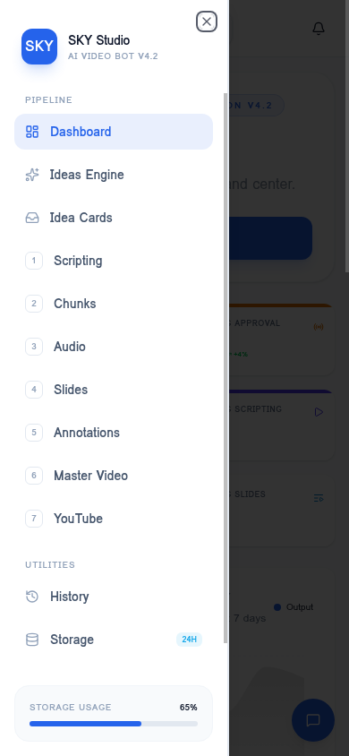

---

## 3. Page Catalogue (every route, screenshot + wiring)

### 3.1 Dashboard — `/dashboard`
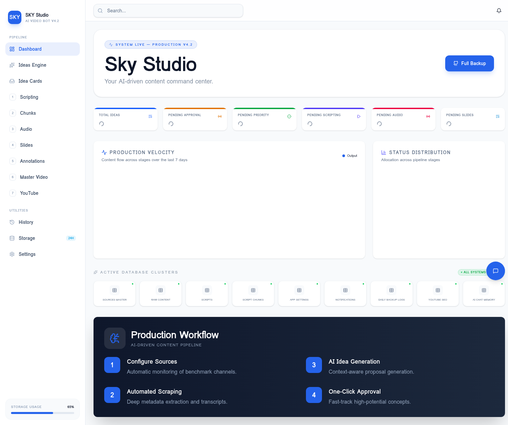

- **Purpose:** Command center showing pipeline health.
- **Sections:**
  - Hero: `SYSTEM LIVE — PRODUCTION V4.2` chip, "Sky Studio" H1, subtitle, **Full Backup** button (top-right) → triggers `runFullBackup` server fn.
  - Six **Status Tiles** with colored top borders: Total Ideas, Pending Approval, Pending Priority, Pending Scripting, Pending Audio, Pending Slides. Each tile pulls counts from `raw_content` grouped by `status`.
  - **Production Velocity** area chart — last 7 days of `raw_content.created_at` aggregated by status.
  - **Status Distribution** horizontal bar chart.
  - **Active Database Clusters** grid: nine tiles, one per public table (Sources Master, Raw Content, Scripts, Script Chunks, App Settings, Notifications, Daily Backup Logs, YouTube SEO, AI Chat Memory) — each links to `/tables`. Green dot = "ALL SYSTEMS NOMINAL".
  - **Production Workflow** dark card: 4-step explainer (Configure Sources → Automated Scraping → AI Idea Generation → One-Click Approval).
- **Mobile:** Tiles stack 1-col → 2-col. Workflow card stays 1-col.
- **Data sources:** `raw_content`, `scripts`, `script_chunks`, `app_settings`.
- **Server fns:** `getDashboardCounts`, `runFullBackup`.

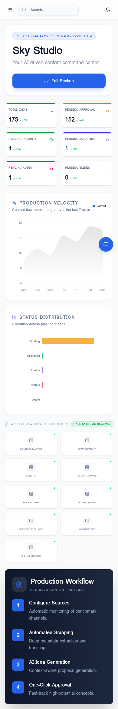

---

### 3.2 Ideas Engine — `/ideas-engine`
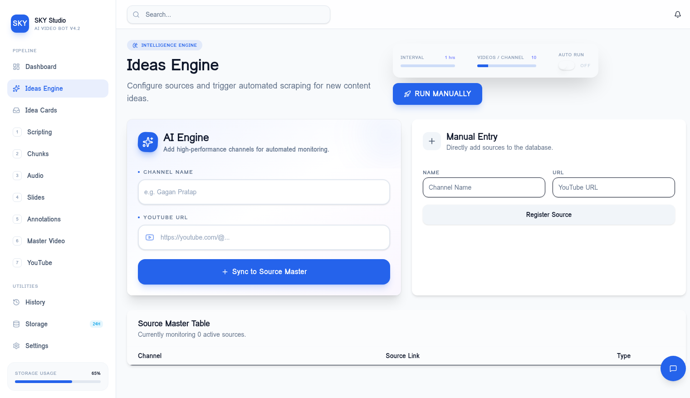

- **Purpose:** Configure YouTube channels to monitor + trigger scraping.
- **Top-right controls:** `INTERVAL` slider (hours), `VIDEOS / CHANNEL` slider (count), `AUTO RUN` toggle, **RUN MANUALLY** primary CTA.
- **Left card "AI Engine":** Channel Name input + YouTube URL input → **Sync to Source Master** button (writes to `sources_master`).
- **Right card "Manual Entry":** simpler Name + URL → **Register Source**.
- **Bottom:** "Source Master Table" listing all active sources (channel, link, type).
- **Server fns:** `addSource`, `runIdeaEngine` (scrapes via Apify YouTube actor, inserts new `raw_content`).
- **Secret used:** `APIFY_API_TOKEN`.

---

### 3.3 Idea Cards — `/idea-cards`
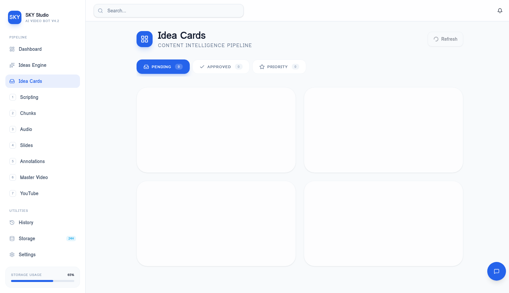

- **Purpose:** Triage scraped ideas. Three tabs: **Pending / Approved / Priority** with live counts.
- Each card (when populated): YouTube thumbnail, original title + channel chip, proposed direction, strategy bullets, meta row (views/date/duration), **Reject** + **Reveal Strategy** + **Approve** buttons.
- **Approve action:** Updates `raw_content.status='approved'` then enqueues the `process-idea` edge function (Apify transcript → OpenAI summarizer → writes `scripts` row stub).
- **Refresh button** top-right re-queries.
- **Realtime:** Subscribes to `raw_content` via Supabase Realtime channel so new ideas appear without reload.

---

### 3.4 Content Preview — `/content-preview`
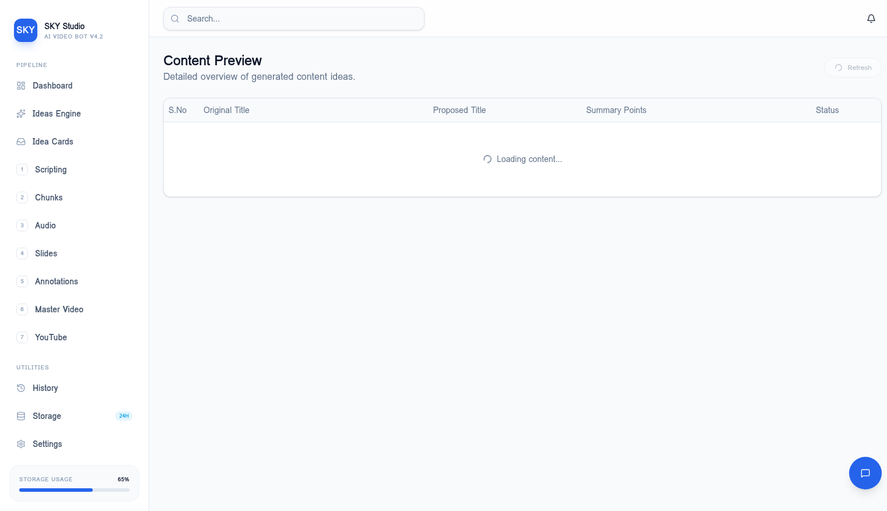

- **Purpose:** Flat tabular overview of every idea + its proposed title, summary points, current status.
- Columns: S.No · Original Title · Proposed Title · Summary Points · Status.
- **Refresh** button re-queries `raw_content` joined to `scripts` (where exists).

---

### 3.5 Script Generator (Scripting) — `/script-generator`
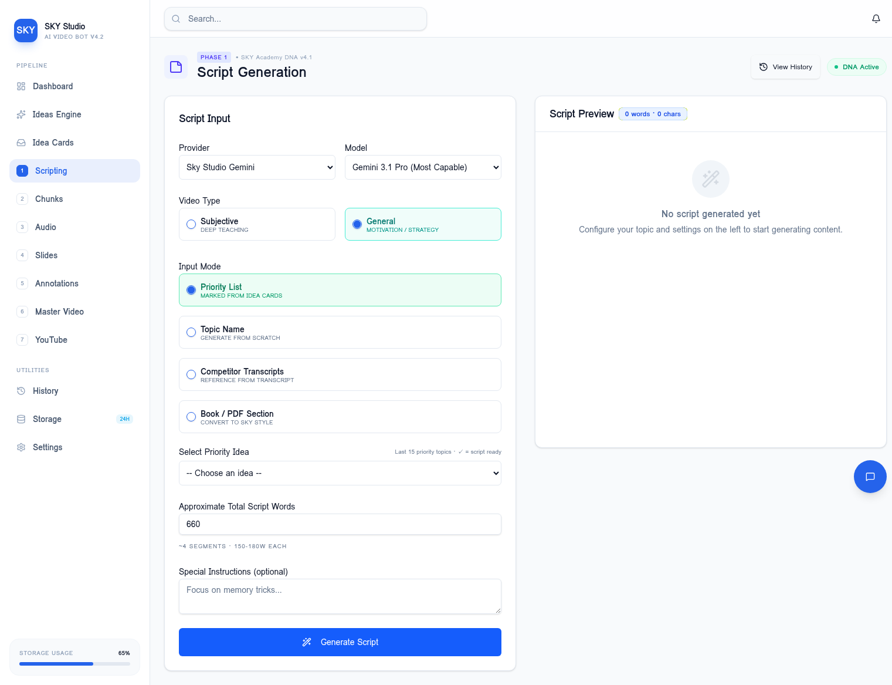

- **Phase 1 — SKY Academy DNA v4.1.** Heart of the writing engine.
- **Left "Script Input" card:**
  - Provider dropdown (default `Sky Studio Gemini`).
  - Model dropdown (default `Gemini 3.1 Pro (Most Capable)`).
  - Video Type radio: **Subjective (deep teaching)** vs **General (motivation/strategy)**.
  - Input Mode radio: **Priority List** (default, marked from Idea Cards), **Topic Name**, **Competitor Transcripts**, **Book / PDF Section**.
  - "Select Priority Idea" dropdown (last 15 priority topics, ✓ = script ready).
  - "Approximate Total Script Words" slider, default 660 (`~4 segments · 150-180w each`).
  - "Special Instructions (optional)" textarea.
  - **Generate Script** primary CTA.
- **Right "Script Preview" card:** Empty state with sparkle icon → live word/char counter once generated.
- **Top-right:** `View History` + green `DNA Active` chip.
- **Server fn:** `generateScript` (calls OpenAI/Gemini with the SKY DNA system prompt, writes to `scripts`).
- **Secrets:** `OPENAI_API_KEY`, `GOOGLE_API_KEY`, `LOVABLE_API_KEY`.

---

### 3.6 Chunks (Chunking Engine) — `/chunks`
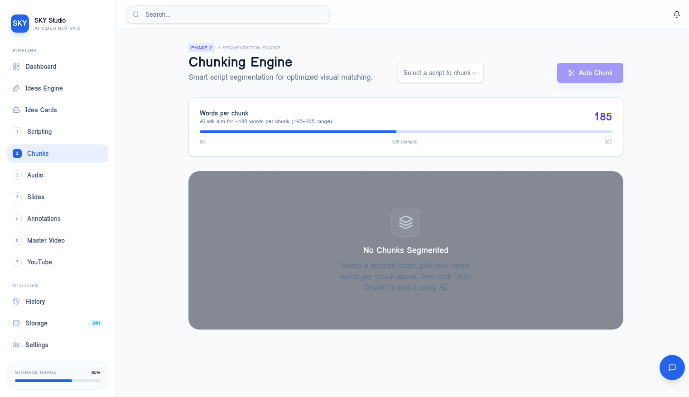

- **Phase 2 — Segmentation Engine.**
- "Select a script to chunk" dropdown + **Auto Chunk** CTA top-right.
- **Words per chunk** slider, default 185 (range 80–300, recommended 165–205).
- Empty state: dark grey panel "No Chunks Segmented".
- **Server fn:** `chunkScript` — splits `scripts.full_text` into `script_chunks` rows (chunk_number, content, word_count).
- Chunk numbers are **0-indexed** in DB but rendered 1-indexed in UI. Slides on disk are named `slide_000.png`, `slide_001.png`, … matching `chunk_number` directly. **Worker downloads try both `slide_{n:03d}.png` and `slide_{n+1:03d}.png`** to remain compatible.

---

### 3.7 Audio Generation — `/audio`
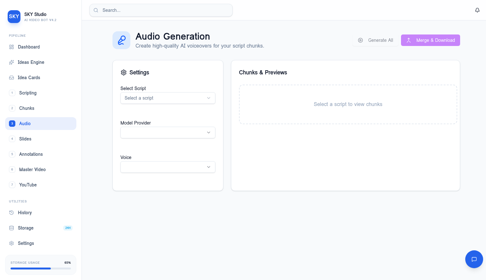

- **Purpose:** TTS voiceovers per chunk.
- **Settings card:** Select Script → Model Provider → Voice.
- **Right "Chunks & Previews"** panel: empty until script chosen, then lists each chunk with play/regenerate.
- Top-right: **Generate All** + **Merge & Download** (concat chunks into one MP3 saved to `audio-files` bucket).
- **Server fns:** `generateAudio`, `mergeAudio`.
- **Secret:** `ELEVEN_LABS_API_KEY` (primary), `OPENAI_API_KEY` (fallback).

---

### 3.8 Slides (Slide Maker) — `/slides`
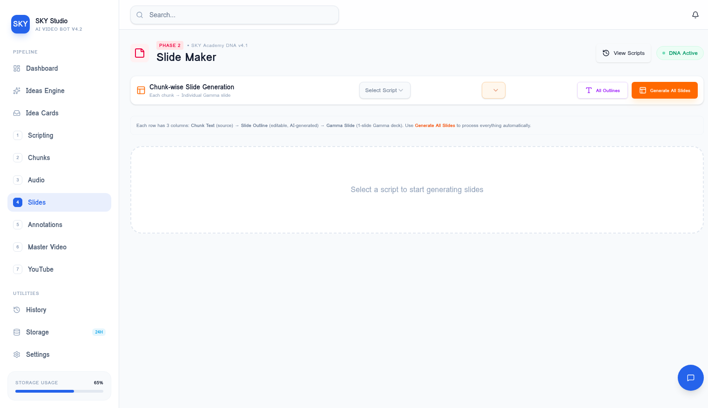

- **Phase 2 — Slide Maker.** Generates a Gamma-style deck, one slide per chunk.
- 3-column-per-row workflow: **Chunk Text** (source) → **Slide Outline** (editable AI-generated) → **Gamma Slide** (1-slide deck).
- Controls: "Select Script" dropdown · model dropdown · **All Outlines** · **Generate All Slides** (orange CTA).
- **Server fns:** `generateSlideOutline`, `generateGammaSlide`. Result PNGs uploaded to `slides/{script_id}/slide_{nnn}.png`.
- **Secret:** `GAMMA_API_KEY`.

---

### 3.9 Annotations — `/annotations`
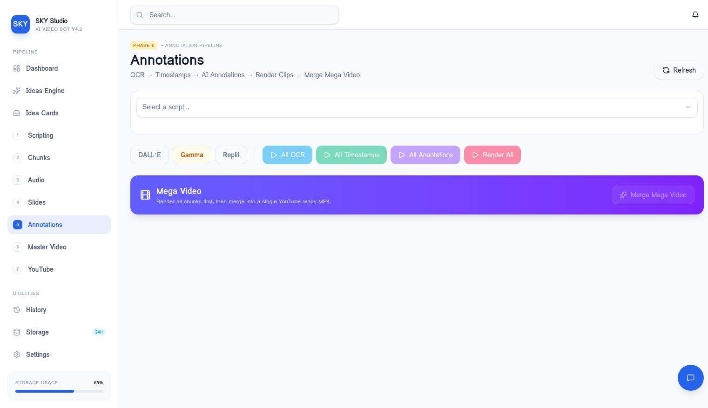

- **Phase 6 — Annotation Pipeline.** Five-step bar: OCR → Timestamps → AI Annotations → Render Clips → Merge Mega Video.
- "Select a script…" dropdown at top.
- Mode chips: **DALL·E · Gamma · Replit**.
- Bulk CTAs: **All OCR · All Timestamps · All Annotations · Render All**.
- Bottom card "Mega Video" with purple gradient → **Merge Mega Video** button (renders all chunks then concatenates).
- **Server fns:** `runOCR` (calls Railway worker `/ocr`), `runTimestamps`, `runAnnotations`, `renderClip`, `mergeMega`.
- **External worker:** `https://sky-annotations-worker.up.railway.app` — Python/ffmpeg/Tesseract. Worker repo: `shaikyusuf789-pixel/sky-annotations-worker`.
- **Data:** `ocr_results`, `audio_timestamps`, `clip_annotations`, `video_clips`.

---

### 3.10 Master Video — `/master-video`
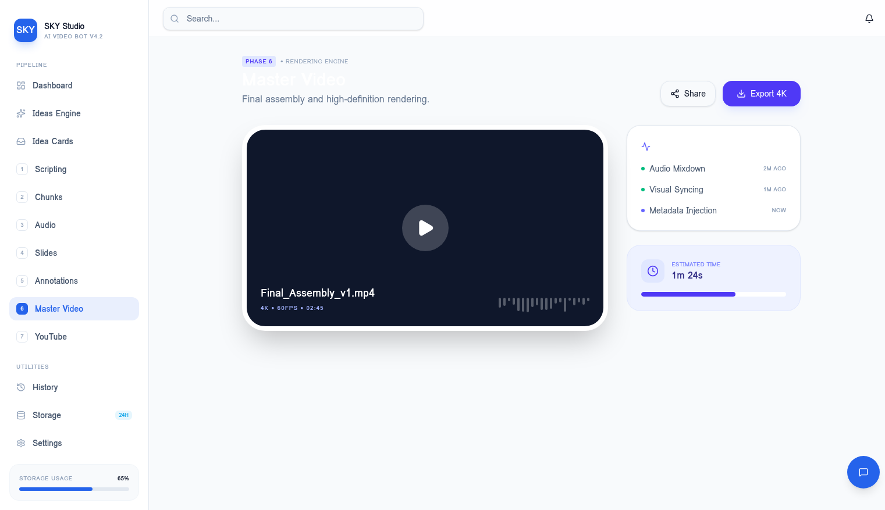

- **Phase 6 — Rendering Engine.** Final 4K assembly.
- Large video preview tile (`Final_Assembly_v1.mp4`, 4K · 60FPS · 02:45) with play icon.
- Right column: Activity log (Audio Mixdown → Visual Syncing → Metadata Injection) + Estimated Time tile.
- Top-right: **Share** + **Export 4K** primary CTA.

---

### 3.11 YouTube Studio — `/youtube`
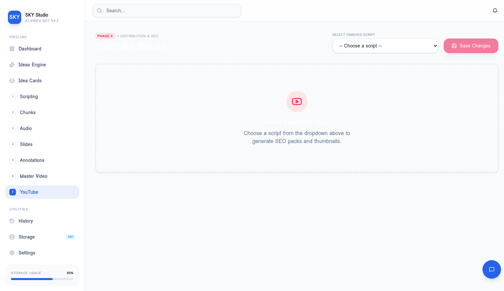

- **Phase 4 — Distribution & SEO.**
- "Select Finished Script" dropdown → unlocks SEO pack + thumbnail generation.
- Top-right: **Save Changes** (writes to `youtube_seo`).
- Empty state: red YouTube logo bubble.

---

### 3.12 History (Neural History) — `/history`
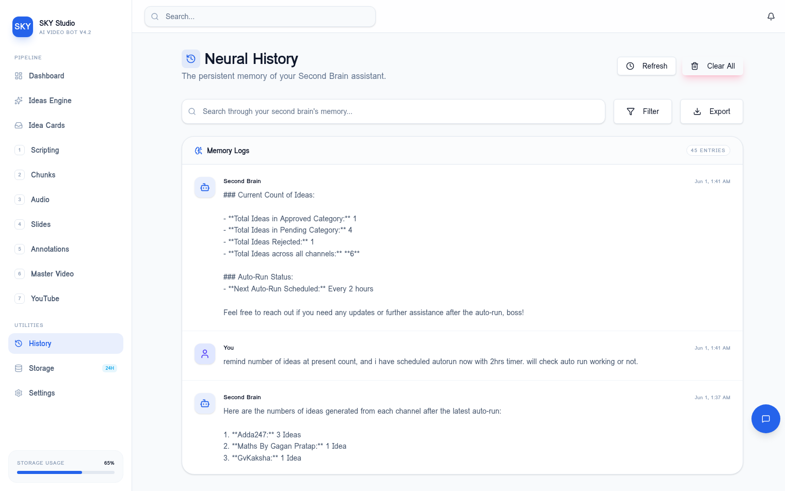

- **Purpose:** Persistent memory log of the "Second Brain" assistant.
- Search bar + Filter + Export buttons.
- "Memory Logs" card listing alternating **You** / **Second Brain** entries with timestamps.
- Top-right: **Refresh** + **Clear All** (destructive — wipes `ai_chat_memory`).
- **Data:** `ai_chat_memory` (currently 45 entries).

---

### 3.13 Storage (App Storage) — `/storage`
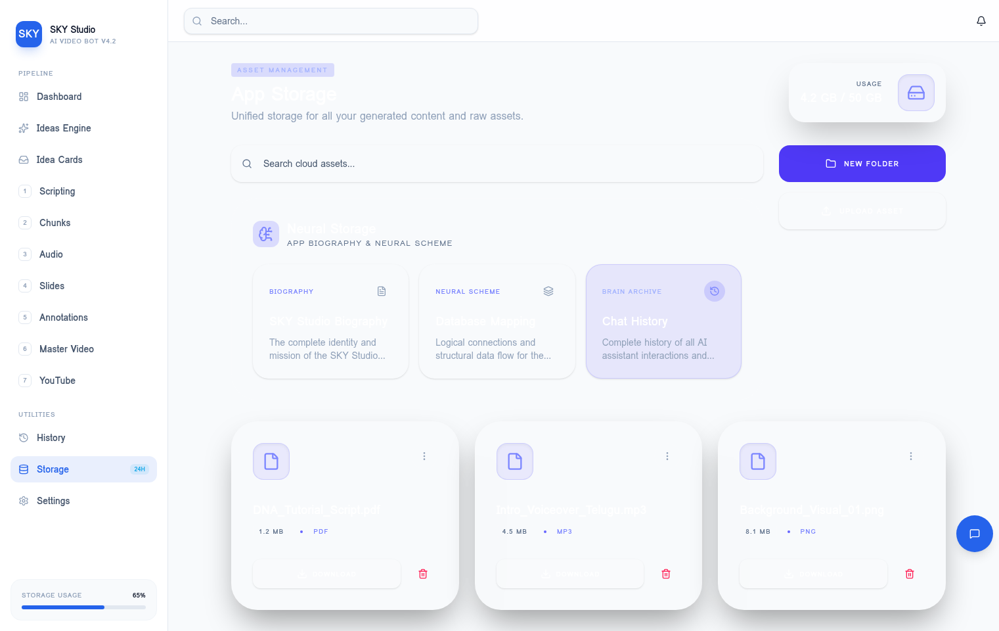

- **Purpose:** Unified asset manager across all three buckets.
- Top: "Asset Management / App Storage" + Usage tile (4.2 GB / 50 GB).
- Search + **New Folder** + **Upload Asset** controls.
- **Neural Storage** strip: three labelled cards — `BIOGRAPHY` (this UI_SPEC), `NEURAL SCHEME` (DB mapping), `BRAIN ARCHIVE` (chat history).
- File grid: each card shows icon, filename, size, type chip, Download + Delete.

---

### 3.14 Settings (System Settings) — `/settings`
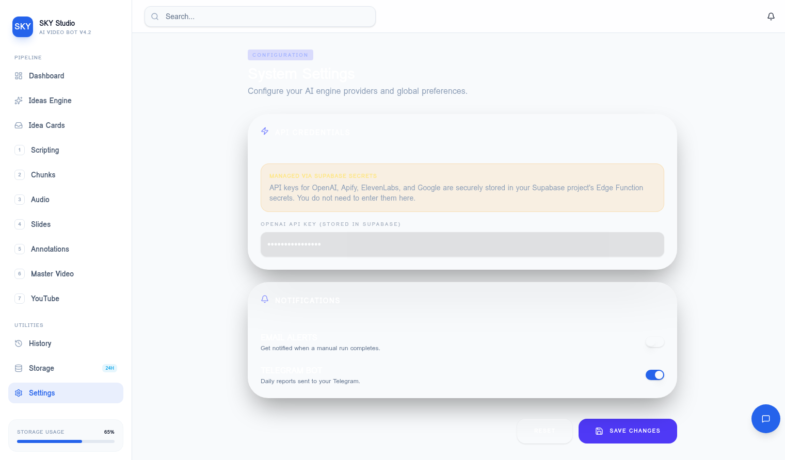

- **API Credentials card:** Amber "Managed via Supabase Secrets" banner. Read-only password-masked fields for OpenAI / Apify / ElevenLabs / Google. **The UI never sends or stores keys client-side** — values live only in Supabase Edge Function secrets.
- **Notifications card:** Email Alerts toggle (off by default), Telegram Bot toggle (on).
- Bottom: **Reset** + **Save Changes**.

---

### 3.15 Tables (Supabase Integration) — `/tables`
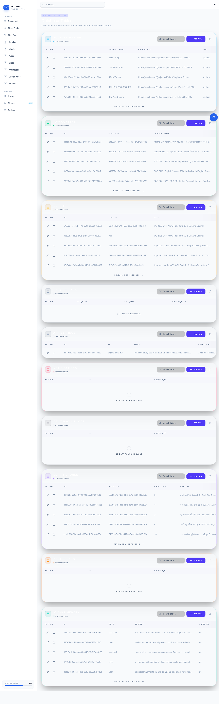

- **Purpose:** Two-way inspector for every public table. Each table renders as a card with: row-count chip, search, **Add Row**, refresh, inline edit/delete actions.
- Cards present: `sources_master` (23), `raw_content` (175), `scripts` (7), `user_uploads` (0), `app_settings` (1), `notifications` (0), `daily_backup_logs` (0), `script_chunks` (70), `youtube_seo` (0), `ai_chat_memory` (45).
- "Reveal N more records" expander at the bottom of each card.

---

### 3.16 Uploads — `/uploads`
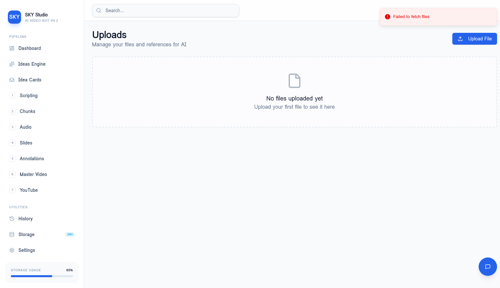

- **Purpose:** User file references for AI grounding (PDFs/books/transcripts).
- Empty state: file icon · "No files uploaded yet".
- **Upload File** button → writes to `user-uploads` bucket + `user_uploads` table.

---

### 3.17 Pipeline (Pipeline Engine) — `/pipeline`
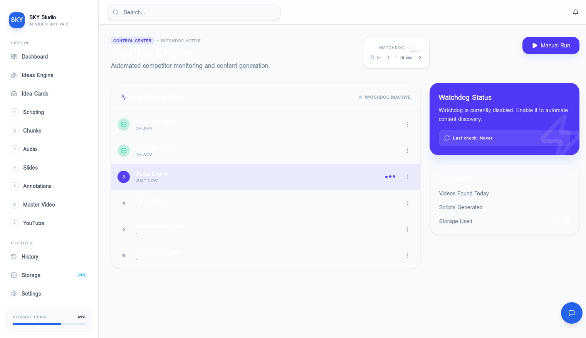

- **Purpose:** Live status of each engine in the chain.
- Top: `CONTROL CENTER · WATCHDOG ACTIVE` chip, hour/vids interval, **Manual Run** primary CTA.
- Left "Live Pipeline Status" card: numbered steps 1–6 (Scraping → Chunking → Audio → Slides → Annotations → Rendering) with status dots and timestamps; current step highlighted blue with animated dots.
- Right column: large **Watchdog Status** card + Quick Stats (Videos Found Today, Scripts Generated, Storage Used).

---

### 3.18 Hook Engine — `/hook-generator`
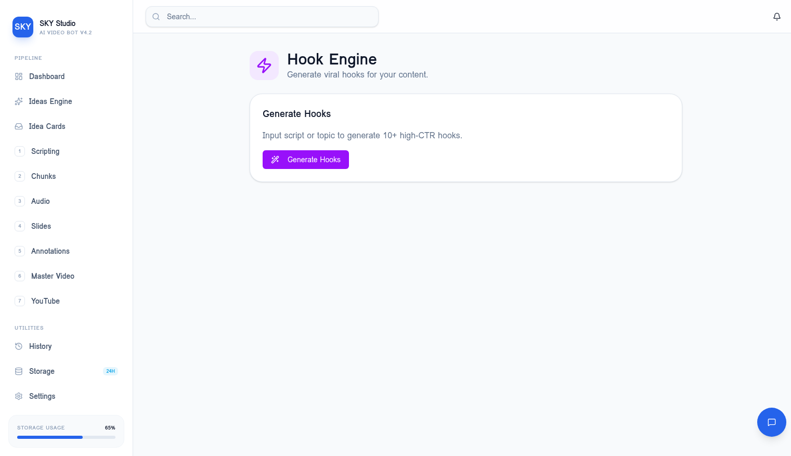

- **Purpose:** Generate 10+ high-CTR opening hooks for any script/topic.
- Single card with purple lightning icon → **Generate Hooks** CTA.

---

## 4. File-System Map

```
src/
├── styles.css              # All design tokens (OKLCH). DO NOT hardcode colors elsewhere.
├── router.tsx              # TanStack Router config (queryClient in context, defaultPreloadStaleTime: 0).
├── start.ts                # createStart() — registers attachSupabaseAuth + errorMiddleware.
├── routes/
│   ├── __root.tsx          # HTML shell, QueryClientProvider, Toaster.
│   ├── index.tsx           # Redirect → /dashboard.
│   ├── _dashboard.tsx      # Sidebar + header layout, <Outlet />.
│   ├── _dashboard.dashboard.tsx
│   ├── _dashboard.ideas-engine.tsx
│   ├── _dashboard.idea-cards.tsx
│   ├── _dashboard.content-preview.tsx
│   ├── _dashboard.script-generator.tsx
│   ├── _dashboard.chunks.tsx
│   ├── _dashboard.audio.tsx
│   ├── _dashboard.slides.tsx
│   ├── _dashboard.annotations.tsx
│   ├── _dashboard.master-video.tsx
│   ├── _dashboard.youtube.tsx
│   ├── _dashboard.history.tsx
│   ├── _dashboard.storage.tsx
│   ├── _dashboard.tables.tsx
│   ├── _dashboard.uploads.tsx
│   ├── _dashboard.pipeline.tsx
│   ├── _dashboard.hook-generator.tsx
│   ├── _dashboard.settings.tsx
│   └── api/                # Server routes (webhooks, public APIs).
├── components/             # shadcn/ui + custom (Sidebar, StatusTile, ChunkRow, …).
├── lib/                    # *.functions.ts (createServerFn) + helpers.
├── integrations/supabase/  # AUTO-GENERATED — never edit. client.ts, client.server.ts, types.ts.
└── hooks/
docs/
├── UI_SPEC.md              # ← this file
├── screenshots/            # 20+ PNGs, referenced relative
└── backup/
    ├── schema.sql          # pg_dump --schema-only of public schema
    └── data.sql            # pg_dump --data-only --inserts
supabase/
├── config.toml             # project_id only — never edit other keys
├── migrations/             # SQL migrations
└── functions/              # Legacy edge functions (process-idea, etc.)
railway-worker/             # Python OCR + ffmpeg worker (deployed on Railway)
```

---

## 5. Database Schema (public)

15 tables; full DDL in `docs/backup/schema.sql`. Current row counts (snapshot):

| Table | Rows | Purpose |
|---|---:|---|
| `sources_master` | 23 | Monitored YouTube channels |
| `raw_content` | 175 | Scraped videos / idea triage |
| `scripts` | 7 | Generated long-form scripts |
| `script_chunks` | 70 | 150-200w segments (chunk_number 0-indexed) |
| `app_settings` | 1 | Single-row config (intervals, watchdog state, telegram, etc.) |
| `app_metadata` | 2 | Misc kv metadata |
| `ai_chat_memory` | 45 | Second Brain conversation log |
| `audio_timestamps` | 0 | Word-level TTS timing |
| `chat_sessions` | 0 | (reserved — multi-session chat) |
| `clip_annotations` | 0 | AI overlay annotations per chunk |
| `daily_backup_logs` | 0 | Cron audit |
| `notifications` | 0 | In-app alerts |
| `ocr_results` | 0 | Per-slide OCR words + bboxes |
| `video_clips` | 0 | Rendered per-chunk MP4 references |
| `youtube_seo` | 0 | Title/desc/tags/thumb per script |

**Naming conventions:** snake_case · primary key `id uuid default gen_random_uuid()` · timestamps `created_at`/`updated_at` with `update_updated_at_column()` trigger pattern (see `docs/backup/schema.sql`).

**RLS status:** Currently permissive (single-user). When porting to multi-user you MUST add `user_id` columns + policies; see `docs/backup/schema.sql` for current policies.

---

## 6. Storage Buckets

| Bucket | Public | Used for |
|---|---|---|
| `slides` | yes | `{script_id}/slide_{nnn}.png` deck PNGs |
| `audio-files` | yes | `{script_id}/{chunk}.mp3` + merged master |
| `user-uploads` | yes | PDFs/transcripts referenced by AI |

---

## 7. Server Logic (TanStack `createServerFn`)

All app-internal logic uses `createServerFn` from `@tanstack/react-start`. Pattern:

```ts
// src/lib/foo.functions.ts
export const doThing = createServerFn({ method: 'POST' })
  .inputValidator(z.object({...}).parse)
  .handler(async ({ data, context }) => { /* … */ });
```

Auth: `requireSupabaseAuth` middleware is wired but currently no-ops since the app is single-user. Browser attaches the bearer token via `attachSupabaseAuth` (registered in `src/start.ts`).

**Key server fns:**
- `runIdeaEngine`, `addSource` → Ideas Engine.
- `processIdea` (calls edge function) → Idea Cards approve.
- `generateScript`, `chunkScript` → Scripting / Chunks.
- `generateAudio`, `mergeAudio` → Audio.
- `generateSlideOutline`, `generateGammaSlide` → Slides.
- `runOCR`, `runTimestamps`, `runAnnotations`, `renderClip`, `mergeMega` → Annotations (proxy to Railway worker).
- `runFullBackup` → Dashboard "Full Backup" button.
- `getDashboardCounts`, `getTablesPreview` → read aggregates.

---

## 8. External Worker (Railway)

- **Repo:** `https://github.com/shaikyusuf789-pixel/sky-annotations-worker` (public).
- **Deploy target:** Railway, auto-deploys from `main`.
- **Endpoints:** `POST /ocr`, `POST /timestamps`, `POST /annotations`, `POST /render`, `POST /merge`, `GET /health`.
- **Env vars needed on Railway:**
  - `SUPABASE_URL` = `https://klhcrdacefntzqwqwiiu.supabase.co`
  - `SUPABASE_SERVICE_ROLE_KEY` = service-role key for the same project
  - `OPENAI_API_KEY` (used by annotation step)
- **Slide download contract:** Worker function `download_slide_to_tmp(script_id, chunk_number)` tries both `slide_{n:03d}.png` and `slide_{n+1:03d}.png` to bridge 0-indexed chunks vs 1-indexed filenames.

---

## 9. Edge Functions (legacy, supabase/functions/)

These predate the TanStack-server-fn migration and remain for back-compat. Most have `verify_jwt = false`. New work should go in `src/lib/*.functions.ts`.

- `process-idea` — Approves a raw_content row → fetches transcript via Apify → summarizes via OpenAI → stubs a `scripts` row.

---

## 10. Realtime Channels

`raw_content` and `scripts` are published on `supabase_realtime`. Pages subscribe via:

```ts
supabase.channel('raw_content')
  .on('postgres_changes', { event: '*', schema: 'public', table: 'raw_content' }, refresh)
  .subscribe();
```

Used by: Idea Cards, Content Preview, Tables, Dashboard counts.

---

## 11. Secrets Contract

Stored ONLY as Supabase Edge Function secrets — never in `.env`, never in the client bundle. Names are case-sensitive.

| Secret | Used by | Where to obtain |
|---|---|---|
| `OPENAI_API_KEY` | Script gen, annotations, fallback TTS | platform.openai.com |
| `GOOGLE_API_KEY` | Gemini script generation | aistudio.google.com |
| `LOVABLE_API_KEY` | Lovable AI Gateway (multi-model proxy) | Lovable project settings |
| `APIFY_API_TOKEN` | Channel scraping + transcript fetch | apify.com console |
| `ELEVEN_LABS_API_KEY` | Primary TTS voices | elevenlabs.io |
| `GAMMA_API_KEY` | Slide deck rendering | gamma.app API |
| `SUPABASE_URL`, `SUPABASE_PUBLISHABLE_KEY`, `SUPABASE_SERVICE_ROLE_KEY` | Server-side DB access | Supabase project settings |
| `SUPABASE_JWKS`, `SUPABASE_ANON_KEY`, `SUPABASE_SECRET_KEYS`, `SUPABASE_PUBLISHABLE_KEYS`, `CUSTOM_SUPABASE_SERVICE_ROLE_KEY`, `SUPABASE_DB_URL` | Auth middleware + direct DB tools | Supabase project settings |

The `client.ts` file uses ONLY `VITE_SUPABASE_URL` + `VITE_SUPABASE_PUBLISHABLE_KEY` from the env — both safe in the browser.

---

## 12. Build / Run

```bash
bun install
bun dev          # vite dev server
bun run build    # production bundle (Vite + TanStack Start)
```

No custom entry files. The TanStack Start Vite plugin handles SSR.

---

## 13. Mobile-First Rules (enforced)

- Every page must be functional at **390 px** width without a horizontal scroll.
- Sidebar collapses into a Sheet behind a hamburger on `< md`.
- Status tiles: 1-col on mobile → 2-col on sm → 3+ on lg.
- Hero CTAs stack vertically on mobile.
- All tables in `/tables` become horizontally scrollable cards.

---

## 14. Replication Checklist for the Receiving AI

If you are an AI rebuilding this app from this document:

1. ✅ Scaffold a TanStack Start v1 project with Vite 7, Tailwind v4, React 19.
2. ✅ Recreate `src/styles.css` with the OKLCH tokens in §1.
3. ✅ Recreate every route file listed in §4 with the exact `createFileRoute("/_dashboard/<name>")` ID.
4. ✅ Recreate the sidebar from §2.2 (PIPELINE + UTILITIES sections, identical labels and order).
5. ✅ Apply `docs/backup/schema.sql` then `docs/backup/data.sql` to a fresh Supabase project. Copy the project URL into the new app's `VITE_SUPABASE_URL`.
6. ✅ Create the three storage buckets in §6 (all public).
7. ✅ Add all secrets from §11 to Supabase Edge Function secrets.
8. ✅ Implement the server fns listed in §7 — function names and shapes must match.
9. ✅ For OCR/render features, redeploy the Railway worker from the repo in §8 and set its env vars.
10. ✅ Visually compare every page against the screenshots in `docs/screenshots/`. The replica must be pixel-equivalent: same colors, same paddings, same chip placements, same CTAs, same icons (Lucide).

If any of these steps would diverge, **stop and ask the user** before proceeding. Do not "improve" the design — replicate it.

---

*End of biography. Maintained alongside the app — every UI change replaces the relevant screenshot + section.*
