# Sky Studio — Full UI & System Biography (v5.1)

> **Purpose.** Canonical, pixel-and-byte description of Sky Studio. Hand this single file + `docs/backup/` SQL to another AI builder (Lovable, Replit, Bolt, Cursor, v0) and they MUST be able to rebuild a **1:1 replica**: same routes, same layout, same colors, same wiring, same secrets contract, same database.
>
> **Last full refresh:** 2026-06-03. Screenshots live in `docs/screenshots/v5/`.
>
> **What changed since v5.0 (2026-06-02):**
> - 🚀 **Railway Memory Optimization:** Render worker (Python) implemented a "memory diet" (half-res compositing + 8-frame LRU cache + aggressive GC) to prevent OOM crashes on the 512MB Railway tier. Peak RSS reduced from ~500MB+ to ~220MB.
> - ⚡ **Annotation Timing Repair:** `ai_annotations.py` now trust ElevenLabs Forced Alignment ground truth. Python repair logic aligns overlays to the EXACT word spoken, fixing the "drifting timing" issue on dense slides.
> - 🆕 **Skip-Mode Bulk Actions:** Added "Skip & Run" buttons for OCR, Timestamps, and Rendering. Allows processing only missing chunks instead of re-running everything (saves time/API cost).
> - 🆕 **ElevenLabs Forced Alignment:** Fully operational as a TanStack server function. Replaces the old Railway `/timestamps` wire with ±50ms accuracy.
> - 🆕 **Google Cloud Vision:** Fully operational as a TanStack server function for OCR. Replaces the legacy Tesseract worker.
> - 🆕 **Railway Mega-Video:** Concatenation logic updated to handle 4K merge more reliably.


---

## 0. Quick Migration Checklist (read first)

1. **Stack.** TanStack Start v1 + Vite 7 + React 19 + Tailwind CSS v4 + Lucide + shadcn/ui (Radix). TypeScript strict.
2. **Routing.** File-based under `src/routes/`. Root `__root.tsx`, dashboard shell `_dashboard.tsx`, leaves `_dashboard.<name>.tsx`.
3. **Database.** Direct Supabase project: `https://eozteueesaemhcmbqcxt.supabase.co`. Full schema in `docs/backup/schema.sql`, data in `docs/backup/data.sql`.
4. **Auth.** Single-user / permissive RLS for now. All Supabase access uses publishable + service-role keys stored as secrets.
5. **Secrets.** Stored in Supabase Edge Function secrets (see §11). Never in the client bundle.
6. **Server logic.** TanStack `createServerFn` (preferred) for OCR / Timestamps / Script / Audio / Slides / Engine. A small set of legacy edge functions remain for back-compat.
7. **External worker.** A separate Railway Python worker handles AI annotations, ffmpeg clip rendering, and mega-merging. Repo: `shaikyusuf789-pixel/sky-annotations-worker`. URL: `https://sky-annotations-worker-production.up.railway.app`. v5.1 includes memory optimizations and timing repairs.
8. **Storage buckets.** `slides`, `audio-files`, `user-uploads`, `video-clips` — all public.
9. **Theme.** Light mode only. Primary blue `oklch(0.55 0.22 257)`. Semantic tokens in `src/styles.css` — never hard-code colors.
10. **Mobile-first.** Every page must be usable at 390 px wide. Sidebar collapses into a Sheet behind a hamburger (see `screenshots/v5/00-mobile-menu-open.png`).

---

## 1. Identity, Brand, Theme

- **Product name:** Sky Studio (sidebar header reads `SKY Studio / AI VIDEO BOT V4.2`).
- **Worker Version:** `2026-06-03.elevenlabs-forced-alignment-017-target-timing-repair` (v5.1).

- **Tagline:** "Your AI-driven content command center."
- **Logo mark:** Rounded-square gradient tile, text `SKY` in white 700-weight; gradient `--primary` → `--accent`.
- **Font:** System UI sans (Inter-style Tailwind default). No custom web font.
- **Color tokens (`src/styles.css`):**
  | Token | Light value | Use |
  |---|---|---|
  | `--background` | `oklch(0.99 0 0)` | App bg |
  | `--foreground` | `oklch(0.15 0.02 257)` | Body text |
  | `--card` | `oklch(1 0 0)` | Card surface |
  | `--muted` | `oklch(0.96 0.005 257)` | Subtle fills |
  | `--primary` | `oklch(0.55 0.22 257)` | CTAs, active nav |
  | `--accent` | `oklch(0.7 0.15 220)` | Highlights |
  | `--border` | `oklch(0.92 0.005 257)` | Hairlines |
  | `--destructive` | `oklch(0.58 0.22 25)` | Delete / danger |
- **Spacing/radius:** `--radius: 0.75rem`; cards `rounded-2xl`; buttons `rounded-xl`.
- **Shadow language:** `shadow-sm` on cards; `shadow-lg` only on primary CTAs.

---

## 2. Global Layout

### 2.1 Root (`src/routes/__root.tsx`)
- Wraps everything in `QueryClientProvider` (TanStack Query, `staleTime: 5min`, `retry: 1`).
- Provides `<Toaster />` (sonner) at root.
- Sets `<title>Sky Studio</title>` + OG meta.

### 2.2 Dashboard layout (`src/routes/_dashboard.tsx`)
Two-column shell:
- **Left sidebar** (fixed 256px on ≥ md, hidden on mobile → Sheet drawer):
  - Header: logo tile + `SKY Studio / AI VIDEO BOT V4.2`.
  - **PIPELINE**: Dashboard · Ideas Engine · Idea Cards · `1 Scripting` · `2 Chunks` · `3 Audio` · `4 Slides` · `5 Annotations` · `6 Master Video` · `7 YouTube`.
  - **UTILITIES**: History · Storage (with `24H` badge) · Settings.
  - Footer: "STORAGE USAGE 65%" progress bar.
- **Main column**:
  - Top header: hamburger (mobile) · centered search · notification bell.
  - Page content with 24-32 px padding.

> `/hook-generator`, `/pipeline`, `/content-preview`, `/tables`, `/uploads` are reachable by URL but not in the sidebar nav. They are admin / utility routes.

### 2.3 Mobile menu (Sheet)
Hamburger → slides in from left → identical nav contents → close (×) top-right.


---

## 3. Page Catalogue (every route, screenshot + wiring)

Each page lists: purpose, key sections, server fns, data sources, mobile notes, screenshots.

### 3.1 Dashboard — `/dashboard`
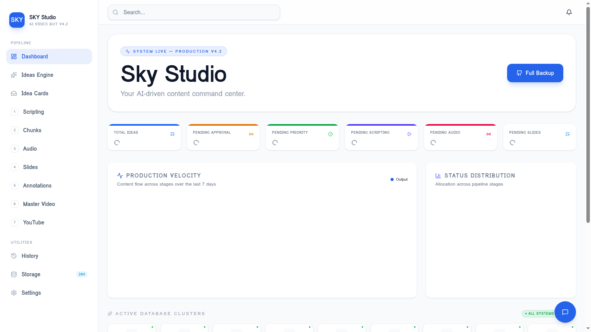
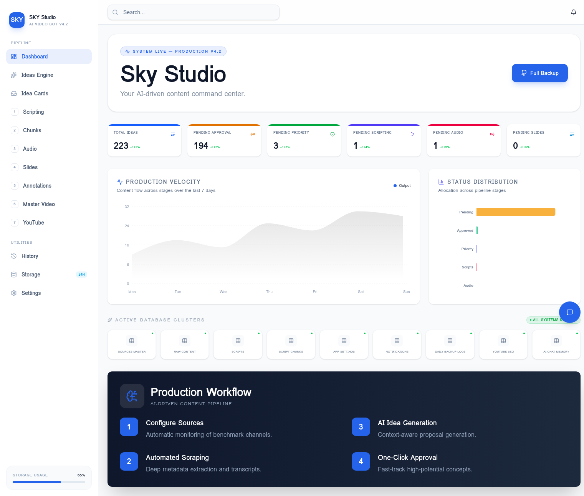
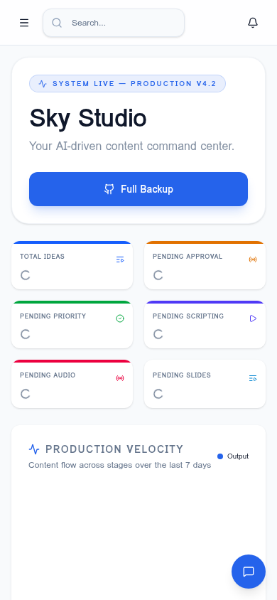

- **Purpose:** Command center showing pipeline health.
- **Sections:**
  - Hero: `SYSTEM LIVE — PRODUCTION V4.2` chip, "Sky Studio" H1, subtitle, **Full Backup** button (top-right) → `runFullBackup` server fn.
  - Six **Status Tiles** with colored top borders: Total Ideas (223), Pending Approval (194), Pending Priority (3), Pending Scripting (1), Pending Audio (1), Pending Slides (0). Each grouped from `raw_content.status`.
  - **Production Velocity** area chart — last 7 days of `raw_content.created_at` aggregated by status.
  - **Status Distribution** horizontal bar chart (Pending / Approved / Priority / Scripts / Audio).
  - **Active Database Clusters** grid: 9 tiles, one per public table — each links to `/tables`. Green dot = "ALL SYSTEMS NOMINAL".
  - **Production Workflow** dark card: 4-step explainer.
- **Mobile:** Tiles stack 1-col → 2-col. Workflow card stays 1-col.
- **Data sources:** `raw_content`, `scripts`, `script_chunks`, `app_settings`.
- **Server fns:** `getDashboardCounts`, `runFullBackup`.

### 3.2 Ideas Engine — `/ideas-engine`
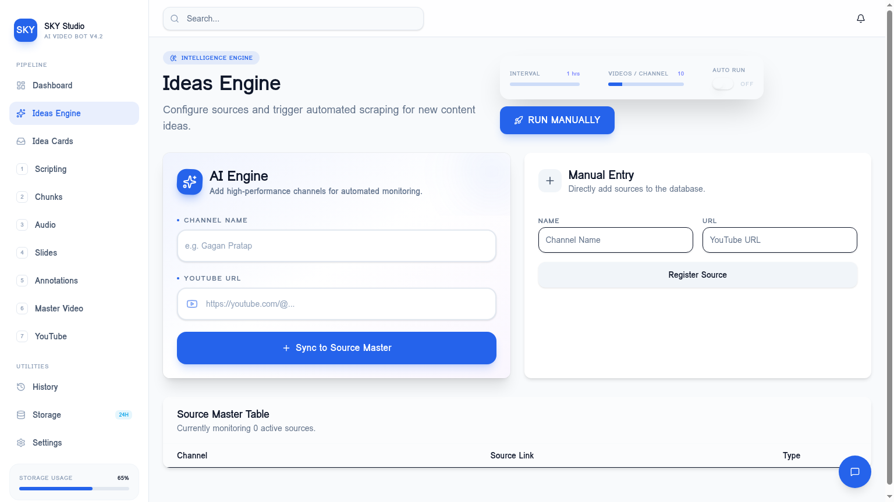
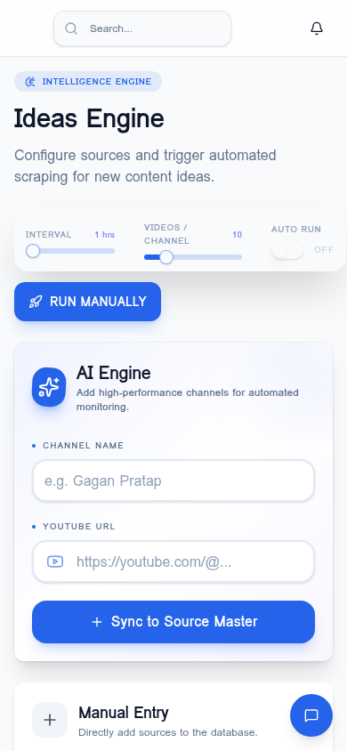

- **Purpose:** Configure YouTube channels to monitor + trigger scraping.
- **Top-right controls:** `INTERVAL` slider (hours), `VIDEOS / CHANNEL` slider, `AUTO RUN` toggle, **RUN MANUALLY** CTA.
- **Left card "AI Engine":** Channel Name + YouTube URL → **Sync to Source Master** (writes `sources_master`).
- **Right card "Manual Entry":** simpler Name + URL → **Register Source**.
- **Bottom:** Source Master Table.
- **Server fns:** `addSource`, `runIdeaEngine` (Apify YouTube actor → inserts `raw_content`).
- **Secret:** `APIFY_API_TOKEN`.

### 3.3 Idea Cards — `/idea-cards`
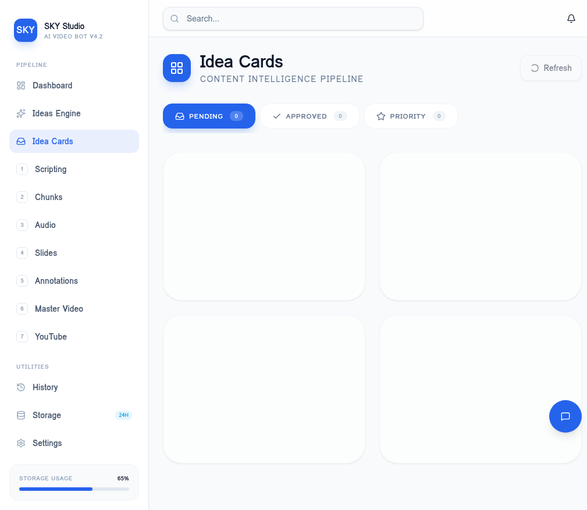
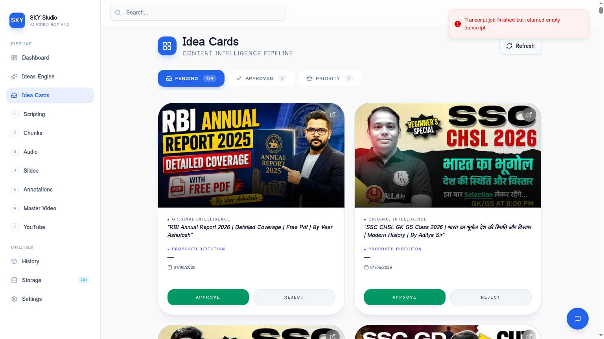
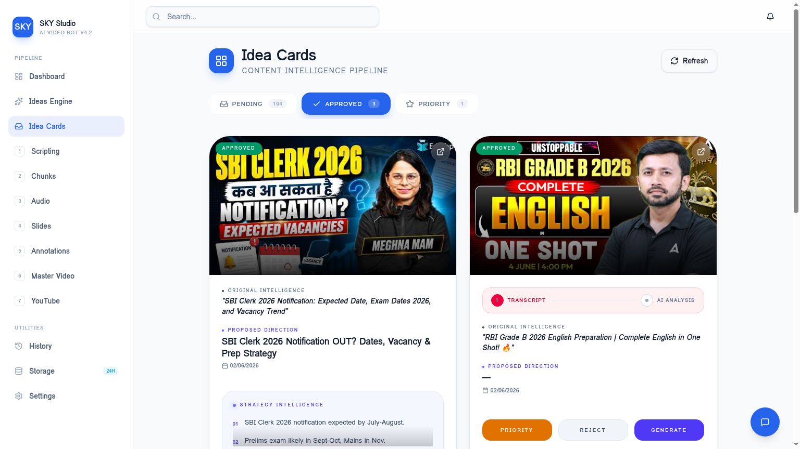
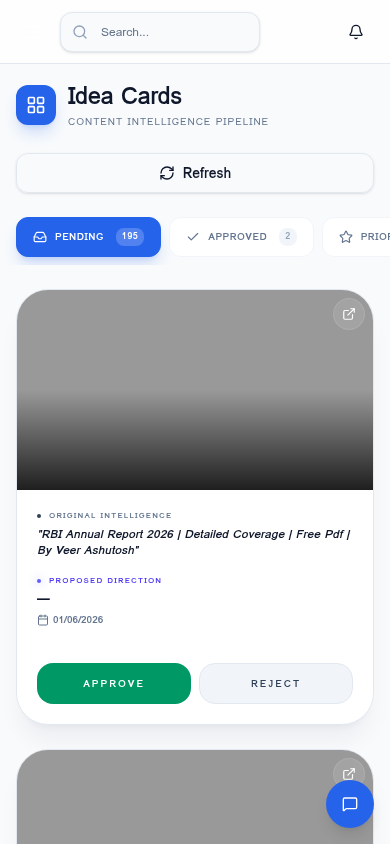

- **Purpose:** Triage scraped ideas. Tabs: **Pending (194) · Approved (3) · Priority (1)** with live counts.
- **Card layout:** YouTube thumbnail · `ORIGINAL INTELLIGENCE` chip · original title · `PROPOSED DIRECTION` · date · action buttons.
- **Pending actions:** Approve / Reject.
- **Approved actions:** Priority / Reject / Generate (kicks off scripting). Strategy Intelligence numbered list visible once transcript is processed.
- **Approve flow:** Updates `raw_content.status='approved'` → enqueues `process-idea` edge function (Apify transcript → OpenAI summarizer → stubs `scripts` row).
- **Refresh** top-right re-queries.
- **Realtime:** Subscribes to `raw_content` so new ideas appear without reload.

### 3.4 Content Preview — `/content-preview`
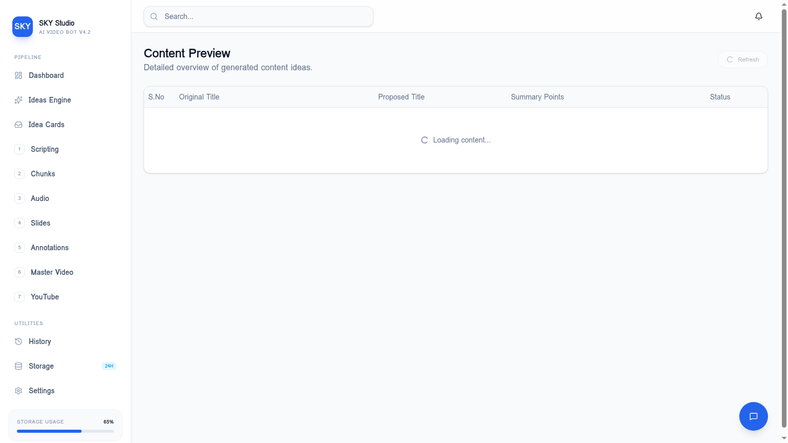
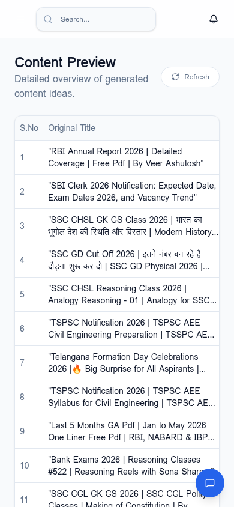

- **Purpose:** Flat tabular overview of every idea + proposed title + status.
- **Columns:** S.No · Original Title · Proposed Title · Summary Points · Status.
- **Refresh** re-queries `raw_content` joined to `scripts`.

### 3.5 Script Generator — `/script-generator`
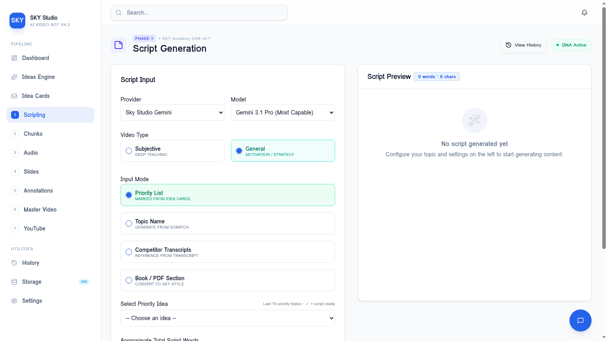
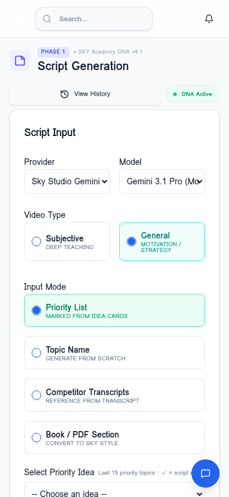

- **Phase 1 — SKY Academy DNA v4.1.** Heart of the writing engine.
- **Left "Script Input" card:**
  - Provider (default **Sky Studio Gemini**) · Model (default **Gemini 3.1 Pro (Most Capable)**).
  - Video Type: Subjective (deep teaching) vs General (motivation/strategy).
  - Input Mode: Priority List · Topic Name · Competitor Transcripts · Book/PDF Section.
  - "Select Priority Idea" dropdown (last 15, ✓ = script ready).
  - "Approximate Total Script Words" slider (default 660 ≈ 4 segments × 150-180 w).
  - Special Instructions textarea.
  - **Generate Script** CTA.
- **Right "Script Preview" card:** Empty state then live word/char counter.
- **Top-right:** View History · green `DNA Active` chip.
- **Server fn:** `generateScript` (OpenAI/Gemini with SKY DNA system prompt → writes `scripts`).
- **Secrets:** `OPENAI_API_KEY`, `GOOGLE_API_KEY`, `LOVABLE_API_KEY`.

### 3.6 Chunks — `/chunks`
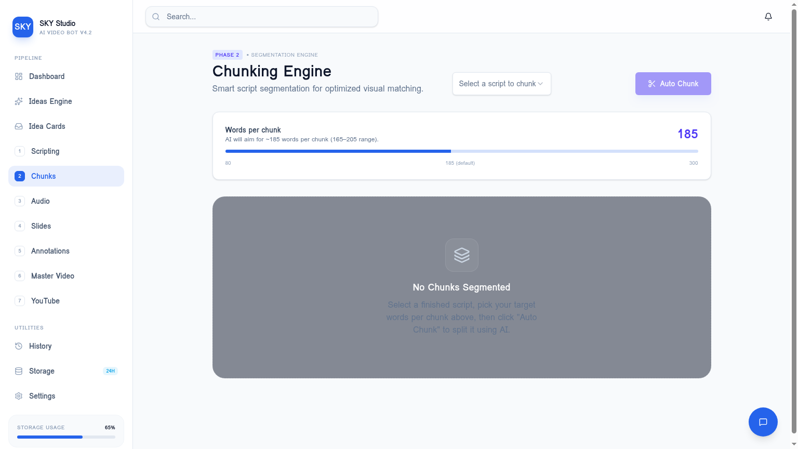
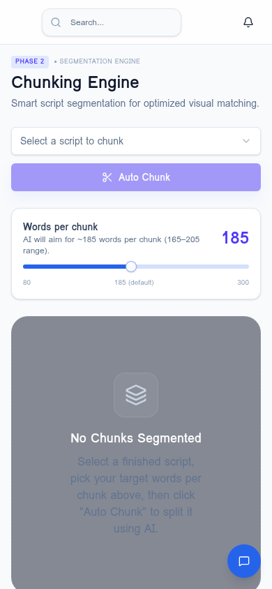

- **Phase 2 — Segmentation Engine.**
- "Select a script to chunk" dropdown + **Auto Chunk** CTA top-right.
- **Words per chunk** slider, default 185 (range 80-300, recommended 165-205).
- **Server fn:** `chunkScript` → splits `scripts.full_text` into `script_chunks` (`chunk_number` 0-indexed in DB, rendered 1-indexed in UI).
- **Indexing contract:** Slides on disk are `slide_000.png`, `slide_001.png`, … matching `chunk_number` directly. The render worker downloads `slide_{n:03d}.png` and falls back to `slide_{n+1:03d}.png` for back-compat.

### 3.7 Audio — `/audio`
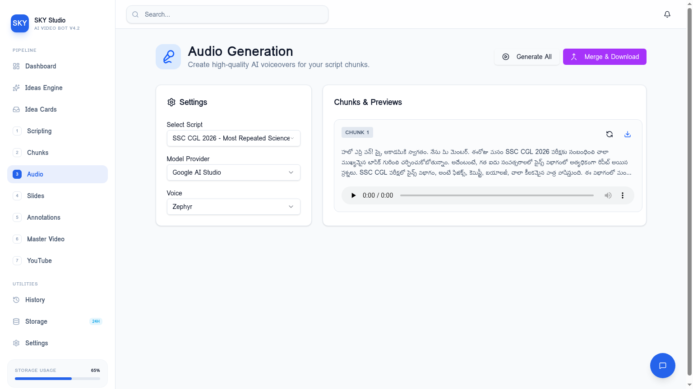
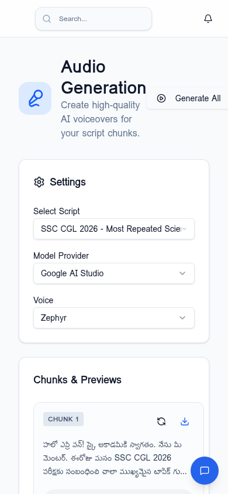

- **Purpose:** Per-chunk TTS voiceovers.
- **Settings card:** Select Script · Model Provider (currently **Google AI Studio**) · Voice (currently **Zephyr**).
- **Chunks & Previews** panel: lists each chunk with native `<audio>` player + Regenerate + Download.
- **Top-right:** **Generate All** · **Merge & Download** (concats chunks into one MP3 in `audio-files`).
- **Server fns:** `generateAudio`, `mergeAudio`.
- **Secrets:** `ELEVEN_LABS_API_KEY` (primary), `GOOGLE_API_KEY` (Gemini TTS / Zephyr), `OPENAI_API_KEY` (fallback).

### 3.8 Slides — `/slides`
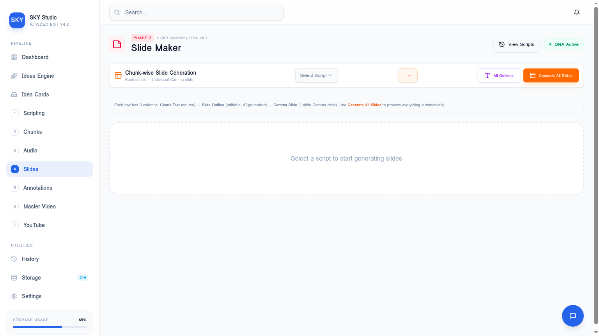
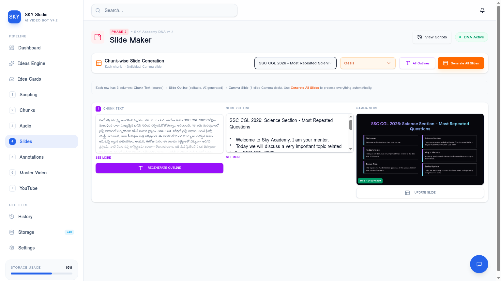
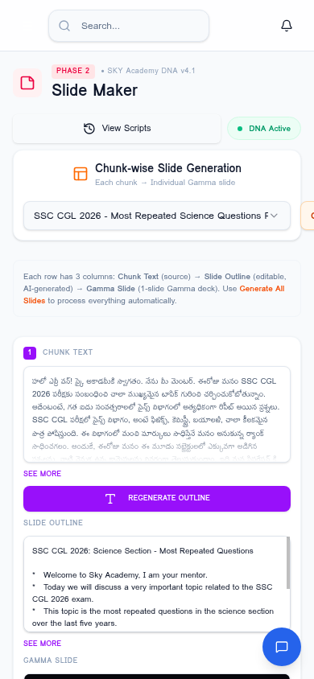

- **Phase 2 — Slide Maker.** Generates one Gamma slide per chunk.
- **Row layout:** Chunk Text (source) → Slide Outline (editable AI bullets) → Gamma Slide (1-slide deck PNG, 16:9 · 2400×1350).
- **Controls:** Select Script · model dropdown (e.g. Oasis) · **All Outlines** · **Generate All Slides** (orange CTA).
- **Server fns:** `generateSlideOutline`, `generateGammaSlide`. PNGs uploaded to `slides/{script_id}/slide_{nnn}.png`.
- **Secret:** `GAMMA_API_KEY`.

### 3.9 Annotations — `/annotations`  ⚡ **SYSTEM REFINED v5.1**
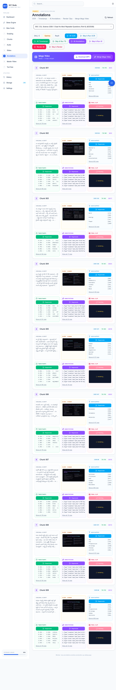

- **Phase 6 — Annotation Pipeline.** Five-step progress bar: **OCR → Timestamps → AI Annotations → Render Clips → Merge Mega Video**.
- **Top Controls:**
  - Select Script dropdown (most recent first).
  - Mode chips: **DALL·E · Gamma · Replit** (selects slide source).
  - **Bulk Actions (Destructive):** All OCR · All Timestamps · All Annotations · Render All (overwrites existing data).
  - **Bulk Actions (Safe/Skip):** Skip & Run OCR · Skip & Run TS · Skip & Run AI · Skip & Render (processes only missing output).
- **Per-chunk row** (collapsible, ordered by `chunk_index`):
  - Badge: Chunk Number (001, 002, ...).
  - Title: Snippet of script.
  - Status Pills: `OCR [count]` (Blue) · `TS [count]` (Green) · `AI [count]` (Purple) · `CLIP` (Rose).
  - **Details (Expanded View):**
    1. **Original Script:** Raw Telugu text.
    2. **Slide · Gamma:** 2400×1350 PNG preview.
    3. **OCR Output:** Google Vision word list with confidence scores. **Regenerate** triggers `runOcr` server fn.
    4. **Timestamps:** ElevenLabs Forced Alignment list (Latin + Telugu glyphs). **Regenerate` triggers `runTimestamps` server fn.
    5. **Annotations:** AI-generated JSON overlay instructions. **Regenerate** calls Railway `/ai/run`.
    6. **Final Clip:** Video player showing the rendered MP4. **Re-render** calls Railway `/clips/render`.
- **Mega Video Card:** Purple gradient header. Displays merge status (idle/running/done). **Download MP4** appears when ready. **Merge Mega Video** triggers Railway `/merge/run`.
- **Footer:** `Worker: sky-annotations-worker-production.up.railway.app` (active monitoring link).

- **Technical Architecture:**
  | Component | Implementation | Provider | Logic Location |
  |---|---|---|---|
  | **OCR** | `runOcr` | Google Vision | TanStack Server Fn (Edge) |
  | **Timestamps** | `runTimestamps` | ElevenLabs FA | TanStack Server Fn (Edge) |
  | **AI Annotations** | `generate_annotations` | GPT-4o (Vision) | Railway Python (`/ai/run`) |
  | **Rendering** | `render_clip` | FFmpeg + Pillow | Railway Python (`/clips/render`) |
  | **Mega Merge** | `mergeMega` | FFmpeg Concat | Railway Python (`/merge/run`) |

- **Railway Memory Diet (v5.1):**
  - Compositing layer downscaled 2x (960×540) to save RAM.
  - FFmpeg neighbor-scaling back to 1080p for output.
  - 8-frame LRU cache replaces the old 48-frame mega-cache.
  - Aggressive `gc.collect()` every 300 frames.
  - Peak RAM on Railway: **~180MB - 220MB**.

- **Annotation Logic:**
  - `ANNOTATION_LEAD_SECONDS` (env var) shifts visual start earlier.
  - `script_phrase` lookup ensures overlays align exactly with spoken words.
  - Types: `underline`, `circle` (max 4 words), `box`, `arrow`.


### 3.10 Master Video — `/master-video`
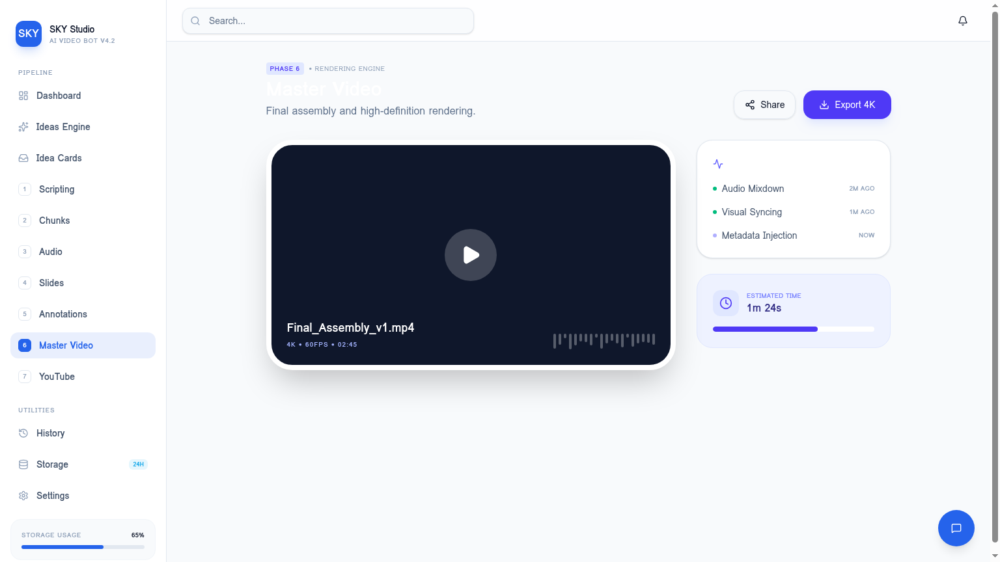
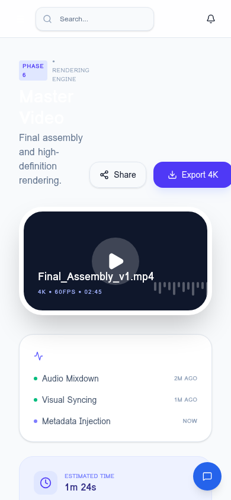

- **Phase 6 — Rendering Engine.** Final 4K assembly preview.
- Large preview tile (`Final_Assembly_v1.mp4` · 4K · 60FPS · 02:45) with play icon.
- Right column: Activity log (Audio Mixdown → Visual Syncing → Metadata Injection) + Estimated Time tile.
- Top-right: **Share** · **Export 4K**.

### 3.11 YouTube Studio — `/youtube`
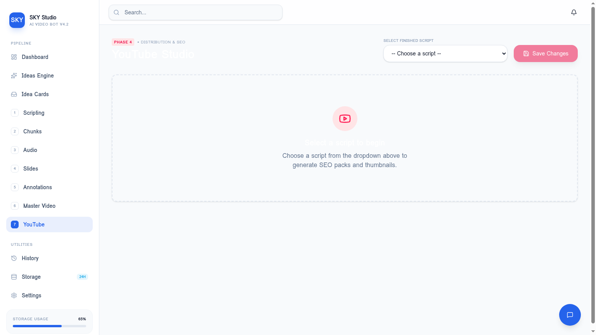
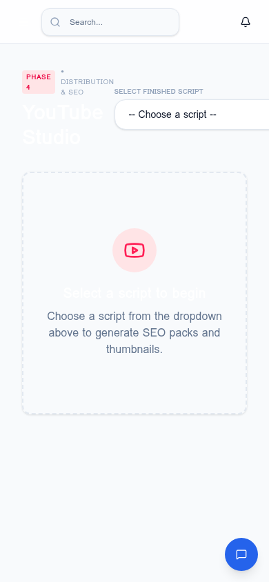

- **Phase 4 — Distribution & SEO.**
- "Select Finished Script" dropdown → unlocks SEO pack + thumbnail tools.
- Top-right: **Save Changes** (writes `youtube_seo`).

### 3.12 History — `/history`
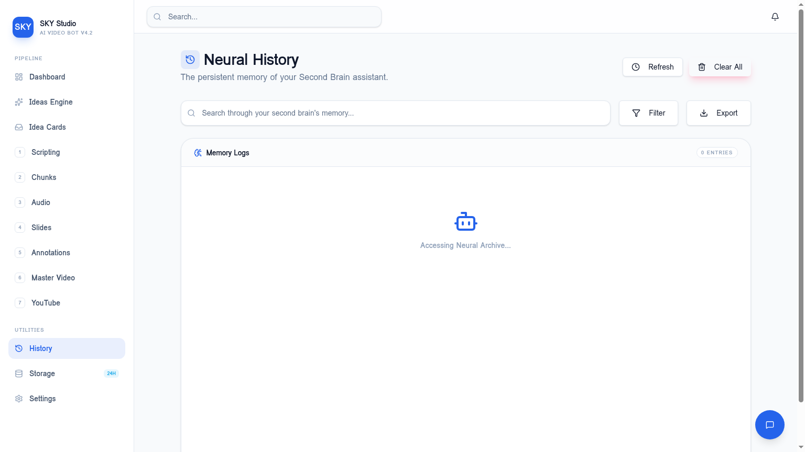
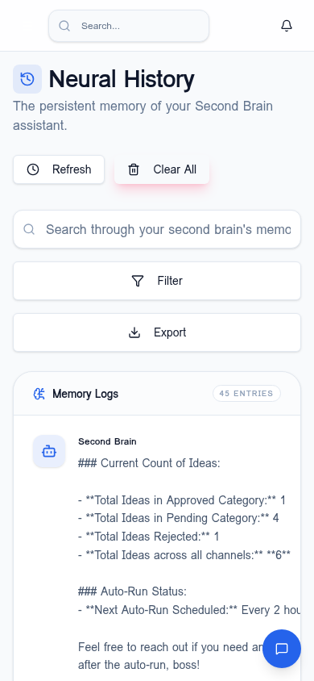

- **Purpose:** Persistent memory log of the "Second Brain" assistant.
- Search bar · Filter · Export.
- Memory Logs card listing alternating You / Second Brain entries with timestamps (45 entries currently).
- Top-right: Refresh · **Clear All** (wipes `ai_chat_memory`).
- **Data:** `ai_chat_memory`.

### 3.13 Storage — `/storage`
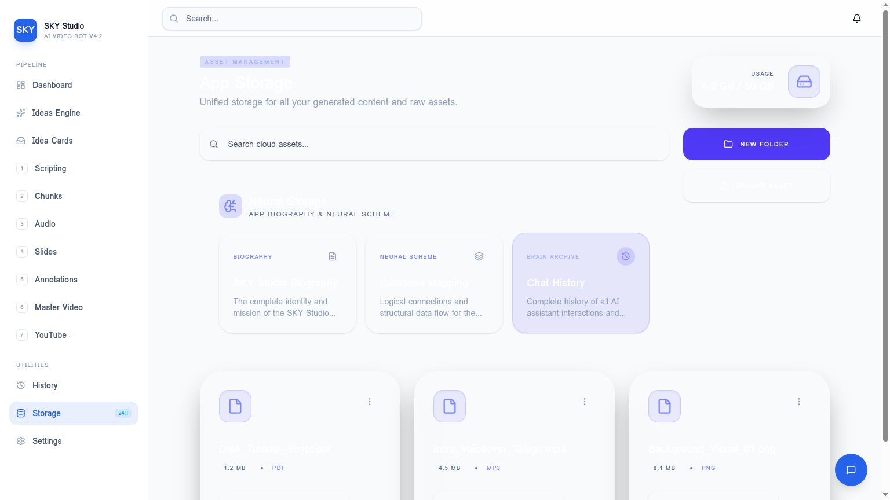
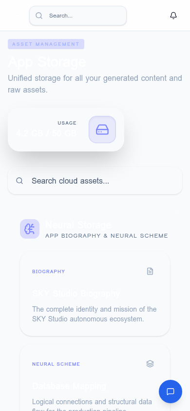

- **Purpose:** Unified asset manager across all four buckets.
- Top: Asset Management / App Storage + Usage tile (4.2 GB / 50 GB).
- Search + **New Folder** + **Upload Asset** controls.
- **Neural Storage** strip: `BIOGRAPHY` (this `UI_SPEC.md`), `NEURAL SCHEME` (`SUPABASE_MAPPING.md`), `BRAIN ARCHIVE` (chat history).
- File grid: icon · filename · size · type chip · Download + Delete.

### 3.14 Settings — `/settings`
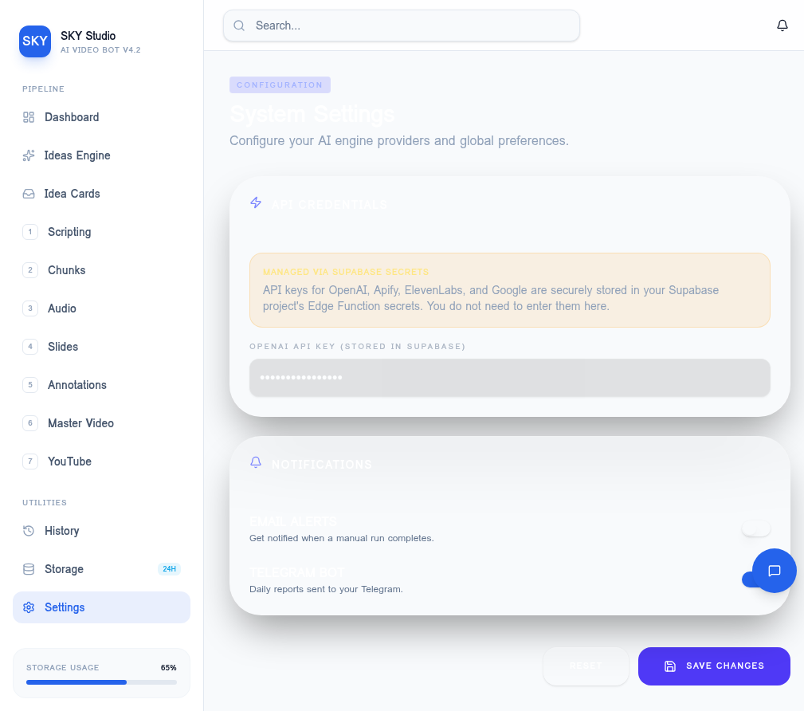
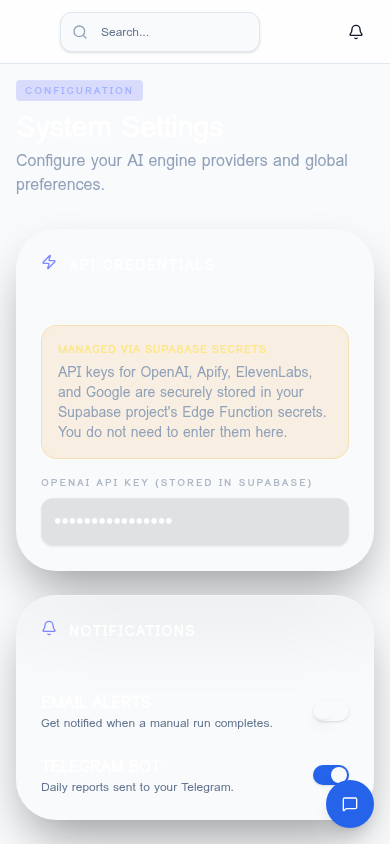

- **API Credentials card:** Amber `MANAGED VIA SUPABASE SECRETS` banner. Read-only masked fields for OpenAI / Apify / ElevenLabs / Google. **Keys are never sent or stored client-side** — they live only in Supabase Edge Function secrets.
- **Notifications card:** Email Alerts toggle (off by default), Telegram Bot toggle (on).
- Bottom: **Reset** · **Save Changes**.

### 3.15 Tables — `/tables`
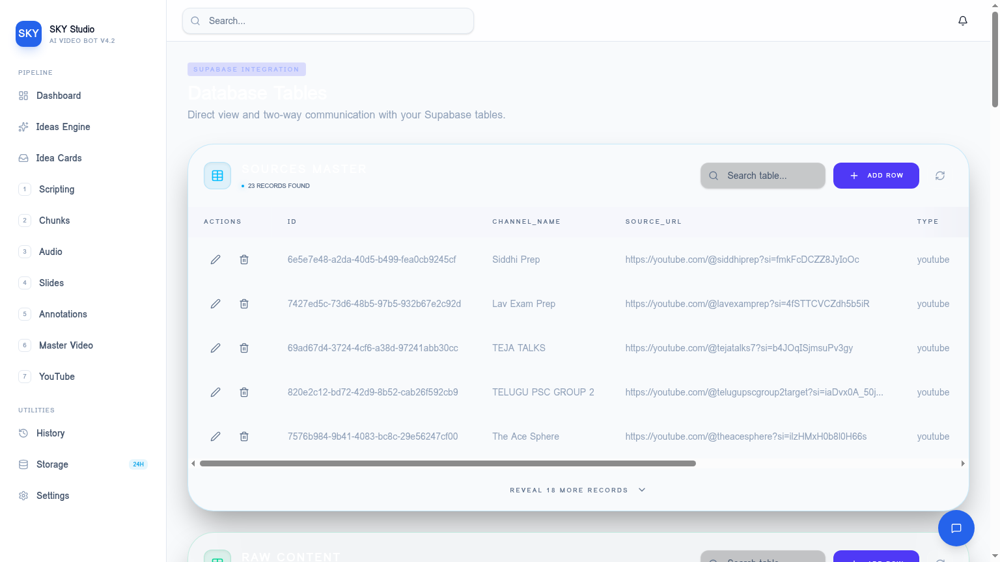
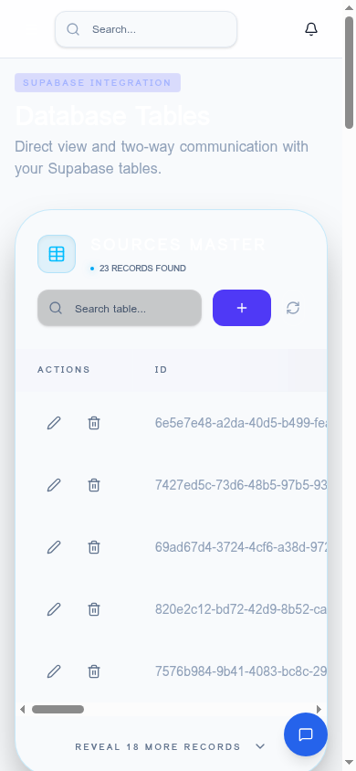

- **Purpose:** Two-way inspector for every public table.
- Each table renders as a card with: row-count chip · search · **Add Row** · refresh · inline edit/delete actions.
- "Reveal N more records" expander at the bottom of each card.
- On mobile each table becomes horizontally scrollable.

### 3.16 Uploads — `/uploads`
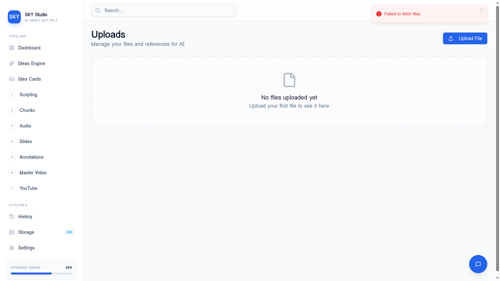
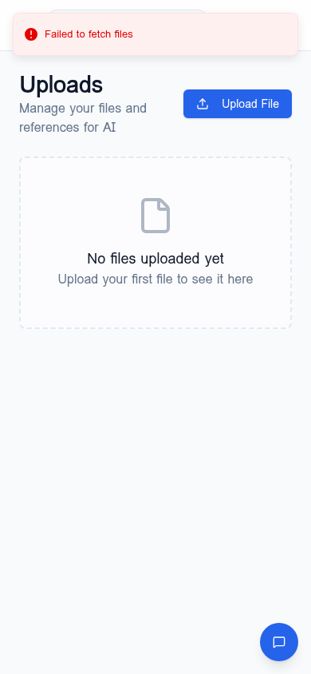

- **Purpose:** User file references for AI grounding (PDFs / books / transcripts).
- Empty state · **Upload File** button → writes to `user-uploads` bucket + `user_uploads` table.

### 3.17 Pipeline Engine — `/pipeline`
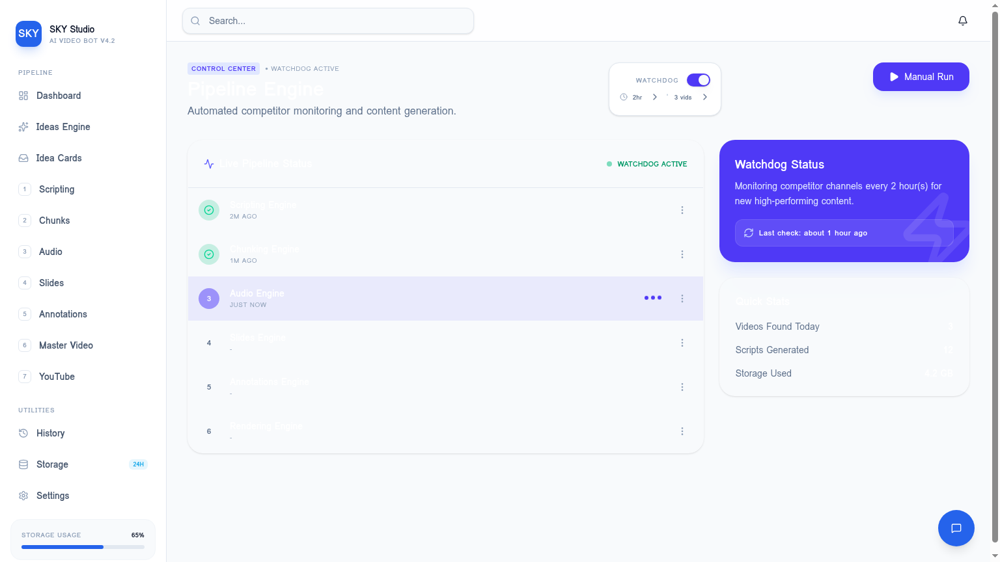
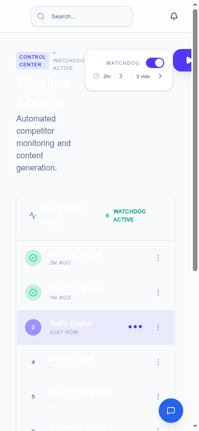

- **Purpose:** Live status of each engine in the chain.
- Top: `CONTROL CENTER · WATCHDOG ACTIVE` chip · interval (hours / videos) · **Manual Run**.
- Left "Live Pipeline Status" card: numbered steps 1-6 (Scraping → Chunking → Audio → Slides → Annotations → Rendering); current step highlighted with animated dots.
- Right: large Watchdog Status card + Quick Stats (Videos Found Today, Scripts Generated, Storage Used).

### 3.18 Hook Engine — `/hook-generator`
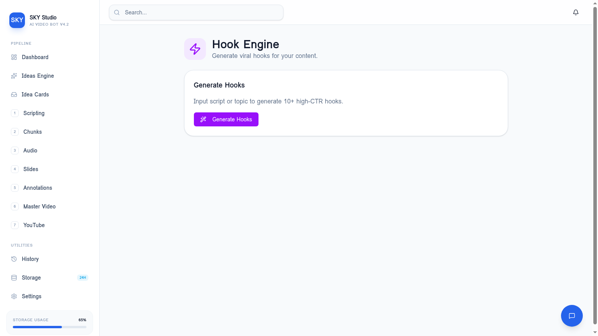
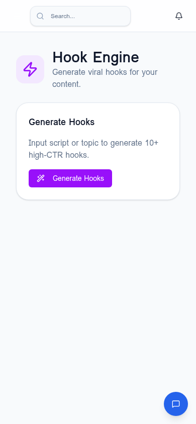

- **Purpose:** Generate 10+ high-CTR opening hooks for any script/topic.
- Single card with purple lightning icon → **Generate Hooks** CTA.

---

## 4. File-System Map

```
src/
├── styles.css                       # OKLCH design tokens — never hard-code colors elsewhere
├── router.tsx                       # TanStack Router config (queryClient in context, defaultPreloadStaleTime: 0)
├── start.ts                         # createStart() — registers attachSupabaseAuth + errorMiddleware
├── routes/
│   ├── __root.tsx                   # HTML shell, QueryClientProvider, Toaster
│   ├── index.tsx                    # → redirect to /dashboard
│   ├── _dashboard.tsx               # Sidebar + header layout, <Outlet />
│   ├── _dashboard.dashboard.tsx
│   ├── _dashboard.ideas-engine.tsx
│   ├── _dashboard.idea-cards.tsx
│   ├── _dashboard.content-preview.tsx
│   ├── _dashboard.script-generator.tsx
│   ├── _dashboard.chunks.tsx
│   ├── _dashboard.audio.tsx
│   ├── _dashboard.slides.tsx
│   ├── _dashboard.annotations.tsx
│   ├── _dashboard.master-video.tsx
│   ├── _dashboard.youtube.tsx
│   ├── _dashboard.history.tsx
│   ├── _dashboard.storage.tsx
│   ├── _dashboard.tables.tsx
│   ├── _dashboard.uploads.tsx
│   ├── _dashboard.pipeline.tsx
│   ├── _dashboard.hook-generator.tsx
│   ├── _dashboard.settings.tsx
│   └── api/                         # Server routes (webhooks, public APIs)
├── components/                      # shadcn/ui + custom (Sidebar, StatusTile, ChunkRow, …)
├── lib/
│   ├── ocr.functions.ts             # ← Google Cloud Vision OCR (NEW)
│   ├── timestamps.functions.ts      # ← ElevenLabs Forced Alignment (NEW)
│   ├── engine.functions.ts          # Ideas Engine (Apify scrape + transcript)
│   ├── config.server.ts             # server-only config + secret access
│   └── *.functions.ts               # generateScript / chunkScript / generateAudio / mergeAudio / generateSlide* / runAnnotations / renderClip / mergeMega / runFullBackup / getDashboardCounts …
├── integrations/supabase/           # AUTO-GENERATED — never edit. client.ts, client.server.ts, types.ts
└── hooks/
docs/
├── UI_SPEC.md                       # ← this file
├── screenshots/
│   └── v5/                          # 41 PNGs (desktop + mobile + detail shots)
└── backup/
    ├── schema.sql                   # pg_dump --schema-only of public
    └── data.sql                     # pg_dump --data-only --inserts
supabase/
├── config.toml                      # project_id only — never edit other keys
├── migrations/                      # SQL migrations
└── functions/                       # Legacy edge functions (process-idea, generate-script*, generate-audio, generate-slides, ai-assistant, …)
railway-worker/                      # Python ffmpeg worker (render + merge only)
```

---

## 5. Database Schema (public)

15 tables; full DDL in `docs/backup/schema.sql`. Snapshot row counts:

| Table | Rows | Purpose |
|---|---:|---|
| `sources_master` | 23 | Monitored YouTube channels |
| `raw_content` | 223 | Scraped videos / idea triage (194 pending / 3 approved / 1 priority) |
| `scripts` | 7 | Generated long-form scripts |
| `script_chunks` | ~70 | 150-200w segments (`chunk_number` 0-indexed) |
| `app_settings` | 1 | Single-row config (intervals, watchdog, telegram, …) |
| `app_metadata` | 2 | Misc kv metadata |
| `ai_chat_memory` | 45 | Second Brain conversation log |
| `audio_timestamps` | >0 | ElevenLabs word-level timing rows |
| `chat_sessions` | 0 | Reserved (multi-session chat) |
| `clip_annotations` | >0 | AI overlay annotations per chunk |
| `daily_backup_logs` | 0 | Cron audit |
| `notifications` | 0 | In-app alerts |
| `ocr_results` | >0 | Google Vision word + bbox JSON per slide |
| `video_clips` | >0 | Rendered per-chunk MP4 references |
| `youtube_seo` | 0 | Title/desc/tags/thumb per script |

**Naming conventions:** snake_case · primary key `id uuid default gen_random_uuid()` · timestamps `created_at`/`updated_at` with `update_updated_at_column()` trigger.

**RLS status:** Permissive (single-user). When porting to multi-user, add `user_id` columns + tight policies before going live.

---

## 6. Storage Buckets

| Bucket | Public | Used for |
|---|---|---|
| `slides` | yes | `{script_id}/slide_{nnn}.png` Gamma deck PNGs |
| `audio-files` | yes | `{script_id}/{chunk}.mp3` + merged master |
| `user-uploads` | yes | PDFs / transcripts referenced by AI |
| `video-clips` | yes | `{script_id}/clip_{nnn}.mp4` rendered per-chunk + `mega.mp4` |

---

## 7. Server Logic (TanStack `createServerFn`)

All app-internal logic uses `createServerFn` from `@tanstack/react-start`:

```ts
// src/lib/foo.functions.ts
export const doThing = createServerFn({ method: 'POST' })
  .inputValidator(z.object({...}).parse)
  .handler(async ({ data, context }) => { /* … */ });
```

Auth: `requireSupabaseAuth` middleware is wired but currently no-ops (single-user). Browser attaches the bearer token via `attachSupabaseAuth` registered in `src/start.ts`.

**Key server fns:**
- `runIdeaEngine`, `addSource` → Ideas Engine.
- `processIdea` → Idea Cards approve (delegates to `process-idea` edge fn).
- `generateScript`, `chunkScript` → Scripting / Chunks.
- `generateAudio`, `mergeAudio` → Audio.
- `generateSlideOutline`, `generateGammaSlide` → Slides.
- `runOcrForChunk`, `runOcrForScript` → **Google Vision** (no Railway).
- `runTimestampsForChunk`, `runTimestampsForScript` → **ElevenLabs alignment** (no Railway).
- `runAnnotations` → OpenAI/Gemini reasoning over OCR + timestamps.
- `renderClip`, `mergeMega` → proxy to Railway worker.
- `runFullBackup` → Dashboard "Full Backup".
- `getDashboardCounts`, `getTablesPreview` → read aggregates.

---

## 8. External Worker (Railway) — render-only

- **Repo:** `https://github.com/shaikyusuf789-pixel/sky-annotations-worker`.
- **Deploy target:** Railway, auto-deploys from `main`.
- **URL (visible in `/annotations` footer):** `https://sky-annotations-worker-production.up.railway.app`.
- **Endpoints in use today:** `POST /render`, `POST /merge`, `GET /health`. Legacy `/ocr` and `/timestamps` endpoints still exist but the UI no longer calls them — OCR and timestamps moved to TanStack server fns calling Google Vision and ElevenLabs directly.
- **Env vars on Railway:**
  - `SUPABASE_URL` = `https://eozteueesaemhcmbqcxt.supabase.co`
  - `SUPABASE_SERVICE_ROLE_KEY` = service-role key for the same project
  - `OPENAI_API_KEY` (used by annotation step if invoked from the worker)
  - `ANNOTATION_LEAD_SECONDS` = `0.6` (default; range 0.4–1.0)
- **Render contract (`workers/render.py`):**
  - Pulls chunk audio from `audio-files`, slide PNG from `slides`, annotations from `clip_annotations`.
  - For every annotation: `start = max(0, ann.start_time - ANNOTATION_LEAD_SECONDS)`.
  - Burns underline / highlight overlays with Pillow, muxes with ffmpeg, uploads MP4 to `video-clips/{script_id}/clip_{nnn}.mp4`, upserts `video_clips`.
- **Slide download bridge:** Worker tries both `slide_{n:03d}.png` and `slide_{n+1:03d}.png` to bridge 0-indexed chunks vs older 1-indexed filenames.

---

## 9. Edge Functions (legacy, `supabase/functions/`)

These predate the TanStack-server-fn migration. Most have `verify_jwt = false`. New work goes in `src/lib/*.functions.ts`.

Present: `ai-assistant`, `apply-fact-corrections`, `clean-script-envelope`, `fact-check-script`, `generate-audio`, `generate-script`, `generate-script-async`, `generate-script-stream`, `generate-slides`, `process-queue`.

`process-queue` is the entry point used by the Approve button.

---

## 10. Realtime Channels

`raw_content` and `scripts` are published on `supabase_realtime`. Pages subscribe via:

```ts
supabase.channel('raw_content')
  .on('postgres_changes', { event: '*', schema: 'public', table: 'raw_content' }, refresh)
  .subscribe();
```

Used by: Idea Cards, Content Preview, Tables, Dashboard counts.

---

## 11. Secrets Contract — System v5.1

Stored ONLY as Supabase Edge Function secrets (never in `.env`, never in the client bundle).

| Secret | Used by | Where to obtain |
|---|---|---|
| `OPENAI_API_KEY` | Script gen, AI annotations (GPT-4o Vision), fallback TTS. | platform.openai.com |
| `GOOGLE_API_KEY` | Gemini script generation + Gemini TTS (Zephyr). | aistudio.google.com |
| `GOOGLE_VISION_API_KEY` | **OCR (Google Cloud Vision API)** via server fn. | console.cloud.google.com |
| `LOVABLE_API_KEY` | Lovable AI Gateway proxy. | Lovable project settings |
| `APIFY_API_TOKEN` | Channel scraping + transcript fetch. | apify.com |
| `ELEVEN_LABS_API_KEY` | Primary TTS voices **and** forced-alignment timestamps. | elevenlabs.io |
| `GAMMA_API_KEY` | Slide deck rendering. | gamma.app |
| `GITHUB_PAT` | **Railway Deployment Automation.** | github.com/settings/tokens |
| `SUPABASE_SERVICE_ROLE_KEY` | Server-side privileged DB access. | Supabase project settings |


---

## 12. Build / Run

```bash
bun install
bun dev          # vite dev server
bun run build    # production bundle (Vite + TanStack Start)
```

No custom entry files. The TanStack Start Vite plugin handles SSR.

---

## 13. System v5.1 Refinements Summary

- **OCR Logic:** Moved from Tesseract (Railway) to **Google Cloud Vision** via `src/lib/ocr.functions.ts`.
- **Timestamp Logic:** Moved from Whisper transcription to **ElevenLabs Forced Alignment** via `src/lib/timestamps.functions.ts`.
- **Annotations Logic:** Repaired `ai_annotations.py` to use `script_phrase` matching against ElevenLabs ground truth, preventing timing drift.
- **Worker Infrastructure:** `railway-worker/workers/render.py` optimized with a "memory diet" (half-res composite, tiny LRU cache, aggressive GC) to survive 512MB RAM limits.
- **Deployment Automation:** Updates to `railway-worker` code are pushed via `GITHUB_PAT` through the GitHub API directly from the environment.

---

## 14. Replication Checklist for the Receiving AI

If you are an AI rebuilding this app from this document:

1. ✅ Scaffold TanStack Start v1 + Vite 7 + Tailwind v4 + React 19.
2. ✅ Recreate `src/styles.css` with the OKLCH tokens in §1.
3. ✅ Configure Supabase project `eozteueesaemhcmbqcxt` and verify §11 secrets.
4. ✅ Wire `/annotations` bulk buttons to both TanStack server fns (OCR/TS) and Railway worker (AI/Render).
5. ✅ Verify the Railway worker has the v5.1 memory optimizations to prevent OOM.

---
**[End of Biography v5.1]**

3. ✅ Recreate every route file in §4 with the exact `createFileRoute("/_dashboard/<name>")` ID.
4. ✅ Recreate the sidebar from §2.2 (PIPELINE + UTILITIES sections, identical labels and order).
5. ✅ Apply `docs/backup/schema.sql` then `docs/backup/data.sql` to a fresh Supabase project. Copy the project URL into `VITE_SUPABASE_URL`.
6. ✅ Create the four storage buckets in §6 (all public).
7. ✅ Add all secrets from §11 to Supabase Edge Function secrets.
8. ✅ Implement the server fns listed in §7 — function names and shapes must match. In particular:
   - `ocr.functions.ts` calls **Google Cloud Vision REST API** (`POST https://vision.googleapis.com/v1/images:annotate?key=…`) with `DOCUMENT_TEXT_DETECTION`.
   - `timestamps.functions.ts` calls **ElevenLabs Forced Alignment** (`POST https://api.elevenlabs.io/v1/forced-alignment`) with the chunk MP3 + ASCII-normalized script text.
9. ✅ Redeploy the Railway worker from §8 for `/render` and `/merge` only. Set `ANNOTATION_LEAD_SECONDS=0.6` on Railway env.
10. ✅ Visually compare every page against `docs/screenshots/v5/`. The replica must be pixel-equivalent.

If any step would diverge, **stop and ask the user** before proceeding. Do not "improve" the design — replicate it.

---

*End of biography v5.0. Maintained alongside the app — every UI change replaces the relevant screenshot + section.*
