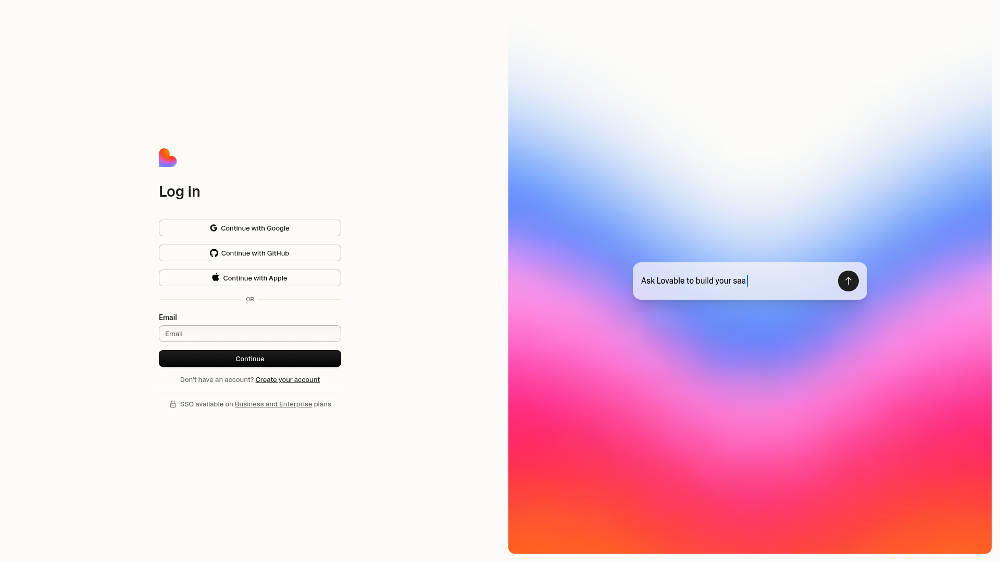
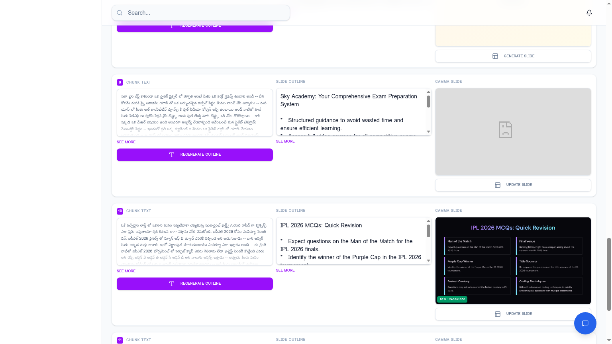

# Sky Studio — Product Biography & Technical Specification

## Overview
Sky Studio is a premium, autonomous AI video production pipeline designed for SKY Academy. It automates the entire content lifecycle: from scraping competitor benchmarks to generating AI strategies, scripts, voiceovers, and final production assets.

---

## 1. Core Architecture
- **Frontend**: React 19 (TanStack Start), Tailwind CSS v4, Lucide Icons.
- **Backend (Database & Auth)**: Direct connection to the user's Supabase project `eozteueesaemhcmbqcxt`.
- **Logic Layer**: TanStack `createServerFn` for app actions, with direct Supabase table reads/writes.
- **AI Integration**: OpenAI, Google AI Studio, Apify, ElevenLabs.

---

## 2. Page-by-Page Breakdown

### 2.1 Dashboard (/dashboard)

- **Purpose**: High-level command center for the Idea Engine.
- **Theme**: Lightweight light theme. Tokens defined in `src/styles.css` (`--background`, `--card`, `--primary` = blue 221/83/53, `--accent` = sky 199/89/48). All UI uses semantic tokens — no hard-coded dark/glass classes.
- **UI Components**:
  - **Header bar**: Mobile menu (Sheet), search, Live indicator, notifications, settings.
  - **Hero**: System Core v4.2 chip + Active chip, title "Sky Studio", Watchdog control + Initialize Scraper / Backup buttons (stacked on mobile).
  - **Status Tiles**: 6 cards (Total / Pending Approval / Priority / Scripting / Audio / Slides) — flat card with bordered icon, mobile-first 1-col → 2-col → 3-col.
  - **Live Database Schema** grid + **Autonomous Workflow** explainer card.
- **Logic**: `Initialize Scraper` runs the local `runIdeaEngine` server fn; reads `sources_master`, scrapes RSS, inserts new `raw_content`.
- **Data**: `raw_content`, `app_settings`, `sources_master` in user's direct Supabase project.

### 2.2 Idea Cards (/idea-cards)

- **Purpose**: Triage and approve scraped content ideas.
- **UI Components**:
  - **Tabs**: Filter by Pending, Approved, or Priority.
  - **Card View**: White cards with shadow on light background. Each card shows:
    - **Thumbnail** with YouTube preview image.
    - **Original Title** in dark text (`text-slate-900`) with channel name chip (`text-indigo-700` on `bg-indigo-50`).
    - **Proposed Direction** title with channel name appended: `"Title - ChannelName"` (e.g., "IPL 2026 Highlights | Most Expected Questions | SSC Bank State PSC - ADDA247").
    - **Strategy Intelligence** bullets in readable dark text (`text-slate-700`) on subtle indigo tint (`bg-indigo-50/60`).
    - **Meta row** (views, date, duration) in `text-slate-600` on `bg-slate-100`.
    - **Reject button** with `bg-slate-100 border-slate-200 text-slate-700`.
    - **Reveal Strategy** toggle in `text-indigo-600`.
- **Logic**: "Approve" button triggers `process-idea` Edge Function (Apify transcript -> OpenAI summarizer).
- **Real-time**: Uses Supabase Realtime to update status as backend steps finish.

### 2.3 Content Preview (/content-preview)

- **Purpose**: Detailed tabular overview of all generated content ideas with full metadata.
- **UI Components**:
  - **Table view**: Columns for Status (badge), Proposed Title, Original Title, Channel, Category, Views, Duration, Published Date.
  - **Proposed Title** now includes channel name appended: `"Title - ChannelName"` (matching the card view format).
  - **Status badges**: Color-coded — Approved (green), Rejected (red), Priority (yellow), Done (blue), Pending (slate).
  - **Refresh button**: Triggers refetch of the ideas list.
- **Logic**: Reads all ideas via `getIdeas` server function; displays in a responsive data table.

### 2.4 Scripting (/script-generator)

- **Purpose**: Full AI script generation in Telugu Unicode, with live token-by-token streaming.
- **Default selections**: Video Type = **General**; Input Mode = **Priority List**.
- **UI Components**:
  - **Input Modes** (each color-coded): Priority List (emerald, default), Topic Name (amber), Competitor Transcripts (sky), Book / PDF Section (violet).
  - **Provider Settings**: Sky Studio Gemini (default — `google/gemini-3.1-pro-preview`), Poe, Anthropic, OpenAI, External Google.
  - **Priority List dropdown**: Shows the **last 15 priority-marked topics** (statuses `Priority` + `Script Done`), most recent first. Each row is prefixed with `✓` (script already saved) or `○` (not generated yet). An emerald banner under the selector confirms when a saved script exists. Auto-refreshes every 10 s.
  - **Existing script → editable**: Selecting a topic with a saved script auto-loads it into the preview; user can toggle **Edit**, modify text, and click **Save Script** (no auto-save).
  - **Regenerate with double confirm**: Every Regenerate trigger (main button, banner button, preview header) opens an AlertDialog — "This will replace the existing script — Cancel / Proceed" — before running a fresh generation honoring the current word count, special instructions, and model.
  - **Live streaming preview**: Tokens stream Gemini-chat-style via SSE from `generate-script-stream` edge function.
  - **Fact-Check panel**: Wrong-statements-only preview (claim + issue + editable correction + source) with "Facts Approved — Merge" to merge corrections preserving tone.
- **Logic**: `generate-script-stream` enforces the **THREE-LAYER RULE** (WHAT = user input only · HOW = 4 reference transcripts for style only · WHERE = SKY DNA structure) with a hard content boundary against transcript topic spillover. Fact-checking runs in the background after the stream completes and persists findings to `scripts.fact_check_findings`.
- **Revisit UX**: Selecting a Priority Idea queries `scripts`, `script_chunks`, and audio progress and shows a status toast (e.g., `✓ Script already generated | ✓ 12 chunks saved | • audio 4/12`).

### 2.5 Chunks (/chunks)

- **Purpose**: Smart segmentation of scripts into production-ready blocks.
- **Logic**: Calls `process-chunks` Edge Function to split long text at natural boundaries. After generation, chunks are auto-saved via `saveChunksFn` (replacing any prior chunks for that script) and a toast confirms the save. Revisits auto-load existing chunks for the selected script.

### 2.6 Audio (/audio)

- **Purpose**: Professional AI voiceover generation.
- **Logic**: Triggers `generate-audio` using ElevenLabs or Google TTS.
- **Storage**: Resulting MP3s are stored in the `audio-outputs` Supabase bucket.

### 2.7 Slides (/slides)

- **Purpose**: Chunk-wise Gamma slide generation for YouTube-ready video slides.
- **Logic**: Generates English-only slide outlines, sends each outline to Gamma as a strict one-card `presentation` with `cardOptions.dimensions = 16x9`, exports the result as PNG, verifies the PNG dimensions, stores the verified preview in the `slides` bucket, and shows the verified 16:9 image in the page instead of relying on Gamma's tall embed rendering.
- **Preview guarantee**: The page displays a green `16:9 · width×height` badge when the exported slide has been verified as widescreen; generation fails instead of saving if Gamma returns a non-16:9 export.

---

## 3. Configuration & Security

### 3.1 API Keys & Secrets
**CRITICAL**: All keys are stored in Supabase project secrets, not in the frontend code.
- `OPENAI_API_KEY`: Core AI logic and script generation.
- `APIFY_API_TOKEN`: YouTube scraping and transcripts.
- `ELEVEN_LABS_API_KEY`: Premium voiceovers.
- `GOOGLE_API_KEY`: Fallback AI models and TTS.

### 3.2 Database Schema
Live schema view available at `/tables`. Main tables:
- `raw_content`: The main pipeline queue.
- `scripts`: Full generated scripts.
- `script_chunks`: Individual video segments with audio/slide links.
- `sources_master`: Configured YouTube channels to monitor.

---

## 4. Migration Guide
To replicate this exact product on a new platform:
1. **Frontend**: Deploy the React code using the `VITE_SUPABASE_URL` of the target project.
2. **Backend**: Run the migration SQL files to create the schema in the new Supabase project.
3. **Secrets**: Manually add the 4 API keys listed above to the target project's secrets.
4. **Functions**: Use the TanStack server functions in `src/lib/engine.functions.ts` for dashboard scraping and data pipeline actions.
