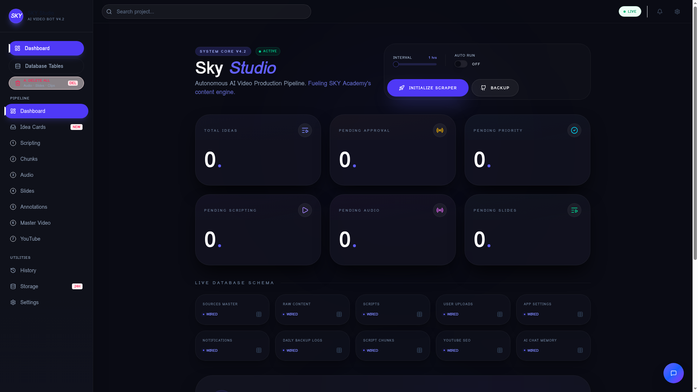
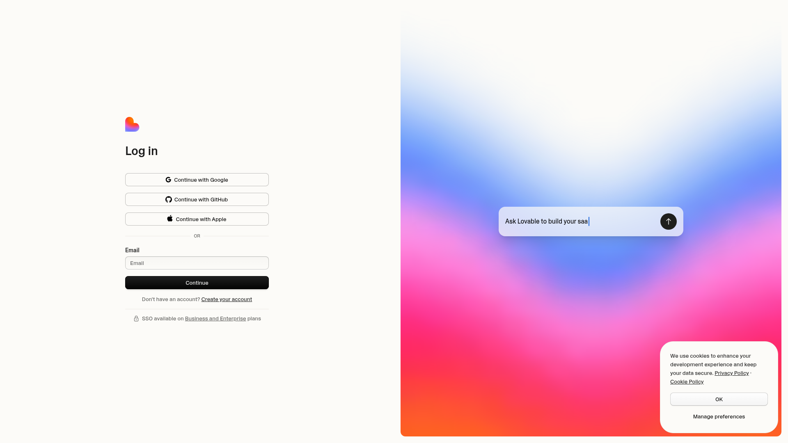
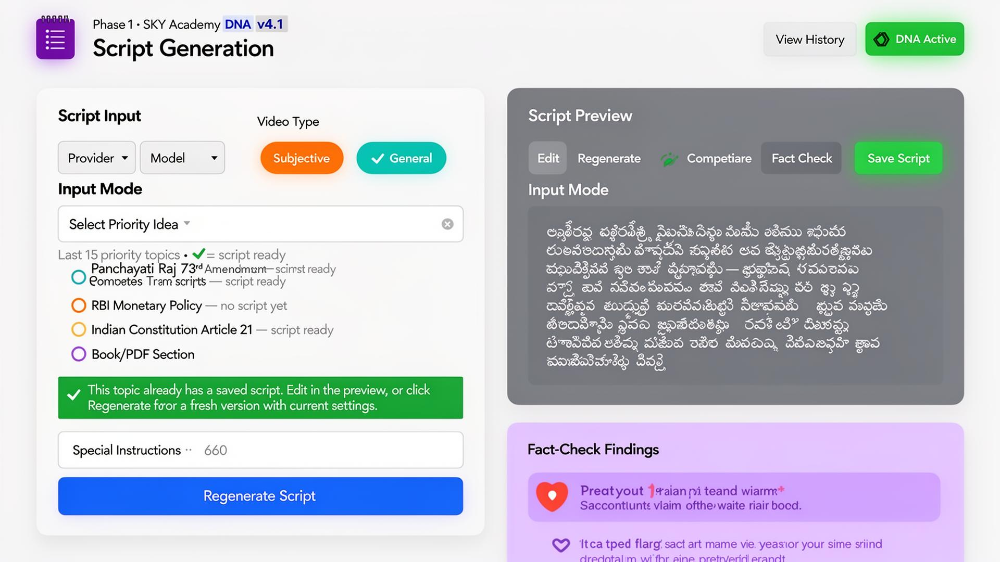

# Sky Studio — Product Biography & Technical Specification

## Overview
Sky Studio is a premium, autonomous AI video production pipeline designed for SKY Academy. It automates the entire content lifecycle: from scraping competitor benchmarks to generating AI strategies, scripts, voiceovers, and final production assets.

---

## 1. Core Architecture
- **Frontend**: React 19 (TanStack Start), Tailwind CSS v4, Lucide Icons.
- **Backend (Database & Auth)**: Direct connection to **Supabase** project `eozteueesaemhcmbqcxt`.
- **Logic Layer**: Supabase Edge Functions (Deno) and TanStack `createServerFn`.
- **AI Integration**: OpenAI (GPT-4o), Google AI Studio (Gemini 2.0), Apify (YouTube Scrapers), ElevenLabs (TTS).

---

## 2. Page-by-Page Breakdown

### 2.1 Dashboard (/dashboard)

- **Purpose**: High-level command center for the Idea Engine.
- **UI Components**:
  - **System Core v4.2 Header**: Title and subtitle with live status indicators.
  - **Action Bar**: "Initialize Scraper" (manual trigger) and "Backup" (GitHub sync).
  - **Status Tiles**: Real-time counts of ideas at each stage (Pending, Approved, Priority, etc.).
- **Logic**: Calls `run-engine` Edge Function to scrape YouTube channels via Apify.
- **Data**: Reads from `raw_content`, `app_settings`, and `sources_master` tables.

### 2.2 Idea Cards (/idea-cards)

- **Purpose**: Triage and approve scraped content ideas.
- **UI Components**:
  - **Tabs**: Filter by Pending, Approved, or Priority.
  - **Card View**: Thumbnails, titles, and live processing status (e.g., "AI Analysis...").
- **Logic**: "Approve" button triggers `process-idea` Edge Function (Apify transcript -> OpenAI summarizer).
- **Real-time**: Uses Supabase Realtime to update status as backend steps finish.

### 2.3 Scripting (/script-generator)

- **Purpose**: Full AI script generation in Telugu Unicode.
- **UI Components**:
  - **Input Modes**: Generate from Topic, Transcript, PDF, or Priority Idea.
  - **Provider Settings**: Choice of OpenAI, Google, or Poe models.
- **Logic**: Triggers `generate-script` Edge Function to produce 150-180 word segments.

### 2.4 Chunks (/chunks)

- **Purpose**: Smart segmentation of scripts into production-ready blocks.
- **Logic**: Calls `process-chunks` Edge Function to split long text at natural boundaries.

### 2.5 Audio (/audio)

- **Purpose**: Professional AI voiceover generation.
- **Logic**: Triggers `generate-audio` using ElevenLabs or Google TTS.
- **Storage**: Resulting MP3s are stored in the `audio-outputs` Supabase bucket.

---

## 3. Configuration & Security

### 3.1 API Keys & Secrets
**CRITICAL**: All keys are stored in **Supabase Edge Function Secrets**, not in the frontend code.
- `OPENAI_API_KEY`: Core AI logic and script generation.
- `APIFY_API_TOKEN`: YouTube scraping and transcripts.
- `ELEVEN_LABS_API_KEY`: Premium voiceovers.
- `GOOGLE_API_KEY`: Fallback AI models and TTS.

### 3.2 Database Schema
Live schema view available at `/tables`. Main tables:
- `raw_content`: The main pipeline queue.
- `scripts`: Full generated scripts.
- `script_chunks`: Individual video segments with audio/slide links.
- `sources_master`: Configured YouTube channels to monitor.

---

## 4. Migration Guide
To replicate this exact product on a new platform:
1. **Frontend**: Deploy the React code using the `VITE_SUPABASE_URL` of the target project.
2. **Backend**: Run the migration SQL files to create the schema in the new Supabase project.
3. **Secrets**: Manually add the 4 API keys listed above to the new project's Edge Function secrets.
4. **Functions**: Deploy the `supabase/functions/` folder to the new project.
